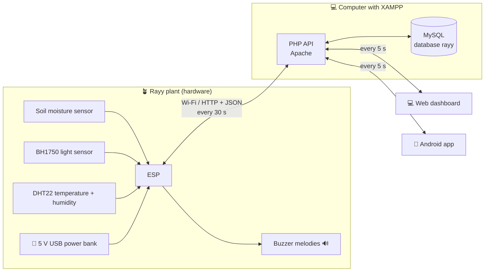

# 🌱 ري (Rayy): a smart IoT plant that shows its feelings (MySQL + XAMPP version)

> **Graduation project.** **Rayy (ري, "watering / quenching thirst")** turns the plant's live readings
> (**soil moisture, light and temperature**) into **emoji faces** shown in the **web dashboard** and the **Android app**,
> and **sound alerts** (a different buzzer melody for each feeling).
> In this version the data is stored in a **MySQL database** on a computer running **XAMPP** (Apache + PHP + MySQL).
> Power comes from a simple **5 V USB power bank** (or phone charger).

| 😊 Happy | 😫 Thirsty | 🥴 Too wet | 🥵 Too hot | 🥶 Cold | 😞 Needs light | 😴 Sleeping |
|---|---|---|---|---|---|---|

---

## 1. Start here

👉 **[docs/00-step-by-step-guide.md](docs/00-step-by-step-guide.md)**: the complete guide from buying the parts to the
final demo, step by step.

🗄️ **[docs/04-database-mysql-xampp.md](docs/04-database-mysql-xampp.md)**: XAMPP, the MySQL tables, the PHP API,
security and useful SQL.

📄 **[docs/Rayy-Documentation-MySQL.docx](docs/Rayy-Documentation-MySQL.docx)**: all the documentation in one Word file.

## 2. What is in this folder

| Folder / file | What it contains | Where it goes |
|---|---|---|
| [`database/rayy.sql`](database/rayy.sql) | Creates the MySQL database `rayy`: 11 tables + starting data | phpMyAdmin → Import |
| [`server/rayy/`](server/rayy) | Web dashboard (HTML/CSS/JS) + **PHP API** (`api/`) | Copy to `C:\xampp\htdocs\rayy` |
| [`firmware/Rayy/`](firmware/Rayy) | ESP32 program (Arduino IDE): sensors, moods, buzzer melodies, HTTP to the API | Upload to the ESP32 |
| [`android/Rayy/`](android/Rayy) | Android Studio project **Rayy** (Kotlin + Jetpack Compose, Arabic / English) | Build in Android Studio |
| [`tests/`](tests) | Unit tests of the plant "mood" logic (run on a PC) | — |
| [`docs/`](docs) | Full documentation (chapters 00 → 10 + Word file + diagrams) | — |

## 3. Documentation index

0. [Step-by-step guide (start here)](docs/00-step-by-step-guide.md)
1. [Requirements and system analysis](docs/01-requirements.md)
2. [Hardware components (bill of materials) and power](docs/02-hardware-bom.md)
3. [Wiring and assembly](docs/03-wiring.md)
4. [Database: MySQL with XAMPP, the PHP API and the setup](docs/04-database-mysql-xampp.md)
5. [ESP32 firmware: installation, how the code works, the melodies](docs/05-firmware.md)
6. [Web application](docs/06-web-app.md)
7. [Android application](docs/07-android-app.md)
8. [Calibration and testing](docs/08-testing-calibration.md)
9. [6-week project plan and team roles](docs/09-project-plan.md)
10. [Graduation report outline, presentation and future work](docs/10-report-outline.md)

## 4. System architecture

* The **ESP32** reads the sensors every 2 s, chooses a mood and plays its melody. There is **no screen on the plant**:
  the emoji face is shown in the web dashboard and the Android app. Without the server the plant still decides its
  mood and plays its melodies.
* Every 30 s it sends **one HTTP request** to `api/device.php`: the live values, a **history** point every 5 min and an
  **event** when the mood changes. The answer brings back the **settings** and any **"Play"** request from the apps.
* The **web** and **Android** apps sign in (`api/login.php`, password checked against a bcrypt hash in MySQL) and ask
  for new data every **5 seconds**. They can change the settings and press **"Play"**.
* The XAMPP computer, the ESP32 and the phone must be on the **same Wi-Fi**; **no internet is required**.

## 5. Quick start (summary)

1. Buy the parts ([docs/02](docs/02-hardware-bom.md)) and wire them ([docs/03](docs/03-wiring.md)).
2. Install **XAMPP**, start **Apache** and **MySQL**, copy `server/rayy` to `C:\xampp\htdocs\`, and import
   `database/rayy.sql` in <http://localhost/phpmyadmin> ([docs/04](docs/04-database-mysql-xampp.md)).
3. Find the computer's IP (`ipconfig`, e.g. `192.168.1.10`).
4. Edit `firmware/Rayy/config.h` (Wi-Fi, `SERVER_URL = "http://192.168.1.10/rayy/api"`, `DEVICE_KEY`) and upload it
   with the Arduino IDE ([docs/05](docs/05-firmware.md)).
5. Open `http://192.168.1.10/rayy/` and sign in with **`team@rayy.app` / `Rayy@2026`** ([docs/06](docs/06-web-app.md)).
6. Set `SERVER_URL` in `android/Rayy/app/src/main/java/com/rayy/app/Model.kt`, open `android/Rayy/` in Android
   Studio and press ▶ ([docs/07](docs/07-android-app.md)).
7. Calibrate the soil sensor and run the tests ([docs/08](docs/08-testing-calibration.md)).

> 💡 **See the dashboard without any hardware:** open `server/rayy/index.html` directly in the browser (demo data),
> or send fake readings with the `curl` command in [docs/04](docs/04-database-mysql-xampp.md) §4.4.
