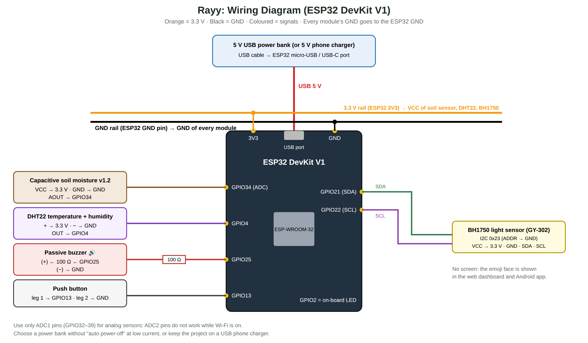

# 00 · Step-by-Step Guide: Build the Whole Project from Zero (MySQL + XAMPP version)

> In this version the data is stored in a **MySQL database** on a computer that runs **XAMPP** (Apache + PHP +
> MySQL). The ESP32, the website and the Android app talk to a small **PHP API**. The computer, the ESP32 and the
> phone must be on the **same Wi-Fi network**, and the computer must stay **on** while you use the system.
>
> **ري is a smart-farming system for many crops**: you add your crops (strawberry field, tomatoes, mint …) in the
> apps, place the sensor device in one crop, and move it to another crop whenever you want.

Follow these steps **in order**. Each step says what to do, how long it takes, and how to check that it worked.
More detail for each step is in the other chapters (01–10).

| Step | What you build | Time |
|---|---|---|
| 1 | Buy the components | 1–3 days |
| 2 | Install the software on the computer | 1 hour |
| 3 | Install XAMPP, create the MySQL database, copy the server files | 30 min |
| 4 | Wire the hardware on a breadboard | 2 hours |
| 5 | Configure and upload the ESP32 code | 30 min |
| 6 | Calibrate the soil sensor | 15 min |
| 7 | Open the web dashboard (served by Apache) | 10 min |
| 8 | Build and install the Android app | 1 hour |
| 9 | Test everything | 2 hours |
| 10 | Final assembly on the pot, report, presentation | 1–2 weeks |

---

## Step 1: Buy the components

Full list with explanations and prices: [02-hardware-bom.md](02-hardware-bom.md). The main items are:

* ESP32 DevKit V1 + a USB data cable (micro-USB or USB-C, depending on the board)
* Capacitive soil moisture sensor v1.2
* DHT22 (temperature + humidity) module
* BH1750 (GY-302) light sensor module
* Passive buzzer (module or bare) + 100 Ω resistor
* Push button
* Breadboard + jumper wires (male-male and female-male)
* **5 V USB power bank** (or any 5 V USB phone charger)
* A crop to test with: a pot or a small planting (strawberry, mint, tomato …) 🌿

✅ **Check:** you have every item in the list before you start step 4.

---

## Step 2: Install the software

On a Windows / macOS / Linux computer:

1. **Arduino IDE 2.x**: <https://www.arduino.cc/en/software>
2. **USB driver** for the ESP32 (only if the board is not detected): CP210x
   (<https://www.silabs.com/developers/usb-to-uart-bridge-vcp-drivers>) or CH340, depending on the chip near the USB port.
3. In Arduino IDE: **File → Preferences → Additional boards manager URLs**, paste
   `https://espressif.github.io/arduino-esp32/package_esp32_index.json`, then
   **Tools → Board → Boards Manager** → search **esp32** → install **"esp32 by Espressif Systems"** (3.x).
4. **Tools → Manage Libraries** → install:
   * **DHT sensor library** by Adafruit (click "Install all")
   * **BH1750** by Christopher Laws
   * **ArduinoJson** by Benoit Blanchon (version 7)
5. **Android Studio Panda (2025.3.1) or newer**: <https://developer.android.com/studio> (for the Android app; the project uses Gradle 9.1.0 + AGP 9.0.1 and runs on Java 17–25)
6. **XAMPP** (Apache + MySQL/MariaDB + PHP 8): <https://www.apachefriends.org> → install it in **`C:\xampp`** (default).
7. A code editor (optional): **VS Code** <https://code.visualstudio.com>.

✅ **Check:** in Arduino IDE, **Tools → Board** shows "esp32 → ESP32 Dev Module".

---

## Step 3: XAMPP, the MySQL database and the server files

Details: [04-database-mysql-xampp.md](04-database-mysql-xampp.md). In short:

1. Open the **XAMPP Control Panel** → press **Start** next to **Apache** and **MySQL** (both turn green).
2. Copy the folder **`server/rayy`** from the project into **`C:\xampp\htdocs\`** →
   you get `C:\xampp\htdocs\rayy\index.html` and `C:\xampp\htdocs\rayy\api\...`.
3. Open <http://localhost/phpmyadmin> → **Import** → choose **`database/rayy.sql`** → **Import**.
   The database **`rayy`** is created with 12 tables, the crop library (12 crop types), two example crops,
   the device **`rayy-01`** and the admin user **`admin@rayy.app`** (password **`Rayy@2026`**).
4. Find the computer's IP address: **Windows → cmd → `ipconfig`** → "IPv4 Address", e.g. `192.168.1.10`.
   The ESP32 and the phone use this address.
5. Allow Apache through the **Windows Firewall** (Windows asks the first time Apache starts → tick **Private
   networks** → Allow).

✅ **Check:** <http://localhost/rayy/> shows the login page, and phpMyAdmin shows the database `rayy` with 12 tables.
From the phone's browser (same Wi-Fi), `http://192.168.1.10/rayy/` also opens the login page.

---

## Step 4: Wire the hardware

**Unplug the USB cable while wiring.** Follow [03-wiring.md](03-wiring.md) and the diagram:



| Module | Pin → ESP32 |
|---|---|
| Soil sensor | VCC → 3V3 · GND → GND · AOUT → **GPIO34** |
| DHT22 | + → 3V3 · − → GND · OUT → **GPIO4** |
| BH1750 | VCC → 3V3 · GND → GND · SDA → **GPIO21** · SCL → **GPIO22** · ADDR → GND |
| Buzzer | (+) → **100 Ω** → **GPIO25** · (−) → GND |
| Button | one leg → **GPIO13** · other leg → GND |

Tip: on the breadboard, connect the ESP32 **3V3** pin to one "+" row and **GND** to one "−" row, then connect all
modules' VCC/GND to these rows.

✅ **Check:** look at every VCC and GND twice. A reversed VCC/GND can burn a module.

---

## Step 5: Configure and upload the ESP32 code

1. Open `firmware/Rayy/Rayy.ino` in Arduino IDE (all the other files open as tabs).
2. In the **`config.h`** tab, fill in:
   ```cpp
   #define WIFI_SSID            "YourWiFi"          // 2.4 GHz network or phone hotspot
   #define WIFI_PASSWORD        "YourPassword"
   #define SERVER_URL           "http://192.168.1.10/rayy/api"   // computer IP from step 3.4
   #define DEVICE_KEY           "rayy-device-key-2026"           // same key as in database/rayy.sql
   #define DEVICE_ID            "rayy-01"                        // this sensor device
   ```
   The crop the device measures is **not** written here: you choose it in the apps (step 7), so the same device
   can be moved from crop to crop.
   ⚠️ Do **not** write `localhost` here: for the ESP32, "localhost" is the ESP32 itself.
3. Connect the ESP32 with the USB cable. Select **Tools → Board → ESP32 Dev Module** and **Tools → Port** (COM…).
4. Click **Upload (→)**. If it says "Connecting…" for a long time, **hold the BOOT button** on the board.
5. Open **Tools → Serial Monitor** at **115200 baud**.

✅ **Check:**
* You hear the "hello" melody.
* The Serial Monitor shows `[server] connected to http://…/rayy/api` and a line of readings every 2 seconds
  ending with `server=1`.
* The Serial Monitor shows `[server] measuring crop 1: فراولة البيت المحمي` (the example strawberry crop).
* In phpMyAdmin → `rayy` → table **`live_status`**, the row of crop 1 changes every 30 s (press **Browse** again).

---

## Step 6: Calibrate the soil sensor

1. Keep the Serial Monitor open. Hold the soil sensor **in the air**: note the `raw` value (e.g. 3050).
2. Put the sensor **in a glass of water** (up to the white line): note the `raw` value (e.g. 1280).
3. Put these numbers in `config.h`: `SOIL_RAW_DRY 3050`, `SOIL_RAW_WET 1280`, then upload again.

✅ **Check:** dry soil shows about 10–25 %, and freshly watered soil about 60–80 %.

---

## Step 7: Web dashboard

The website is already installed: Apache serves it from `C:\xampp\htdocs\rayy`.

1. On the computer open <http://localhost/rayy/>, on a phone or another computer in the same Wi-Fi open
   `http://192.168.1.10/rayy/`.
2. Sign in with `admin@rayy.app` / `Rayy@2026` (or press **Create account** to make a new user).
3. **My crops** → **+ Add crop** → name (e.g. "My strawberries"), **crop type** (the ideal values are filled
   automatically) and location → **Save**.
4. Open the crop → **Sensor device of this crop** → choose `rayy-01` → **Move to this crop**. Within 30 s the
   device measures this crop and uses its thresholds. (Or use the **Devices** page.)
5. Admin only: the **Users** page creates users, changes roles and deletes users.
6. Without the server (only to see the design), open `index.html` directly or add `?demo=1`: it shows fake data.

✅ **Check:** the crop card shows the crop's emoji (e.g. 😫 when the soil sensor is in dry air), and the crop page
says "Online". The values refresh every 5 seconds.

---

## Step 8: Android app

0. Unzip the project into a folder whose path has **English letters only**, for example `E:\Rayy-Project`
   (not `E:\Ray ري\...`). Android Studio refuses to build in folders with Arabic letters in the path.
1. Open `android/Rayy/app/src/main/java/com/rayy/app/Model.kt` and set the computer's address:
   `const val SERVER_URL = "http://192.168.1.10/rayy/api"` (for the Android **emulator** on the same computer use
   `http://10.0.2.2/rayy/api`).
2. Android Studio → **File → Open** → choose the **`android/Rayy`** folder (the project name shows as **Rayy**) → wait for "Gradle sync" to finish (the first time it downloads Gradle 9.1.0).
3. Connect your phone (enable **Developer options → USB debugging**) or create an emulator → press **▶ Run**.
4. To get an installable file: **Build → Build App Bundle(s) / APK(s) → Build APK(s)**. The file is at
   `android/Rayy/app/build/outputs/apk/debug/app-debug.apk`.

✅ **Check:** you can create an account and sign in; **My crops** shows every crop with its emoji; tapping a crop
shows its live values; **Move to this crop** moves the device; "Play" makes the buzzer play. The admin sees a
**Users** tab.

---

## Step 9: Test everything

Use the test table in [08-testing-calibration.md](08-testing-calibration.md). The most important tests:

1. Take the soil sensor out of the soil → 😫 face + "thirsty" melody + apps show "Thirsty".
2. Put it back into wet soil → 😊 face + "thank you" melody.
3. Cover the light sensor during the day → 😞 "needs light".
4. Stop **Apache** in XAMPP → the melodies still work on the device, the LED blinks; start it again → the data comes back.
5. Move the device to another crop (e.g. cactus) → within 30 s the device uses the cactus thresholds (dry soil is
   now "happy"); the strawberry history stays in its own crop.
6. Run the automatic API test: `bash tests/test_api.sh http://localhost/rayy/api` → `44 passed, 0 failed`.

---

## Step 10: Final assembly, report and presentation

1. Move the circuit from the breadboard to a small **perfboard** (solder) or keep a mini breadboard inside a box.
2. Put it in a small **box** with holes for the buzzer and the USB cable. Fix the box to
   the pot. Keep the DHT22 and BH1750 **outside** the box.
3. Keep the **XAMPP computer on** and in the same Wi-Fi during the demo.
4. Power it with the **power bank** (it lasts about 2–3 days with 10,000 mAh; recharge it like a phone) or with a
   USB phone charger permanently.
5. Write the report using [10-report-outline.md](10-report-outline.md), and follow the plan in [09-project-plan.md](09-project-plan.md).
