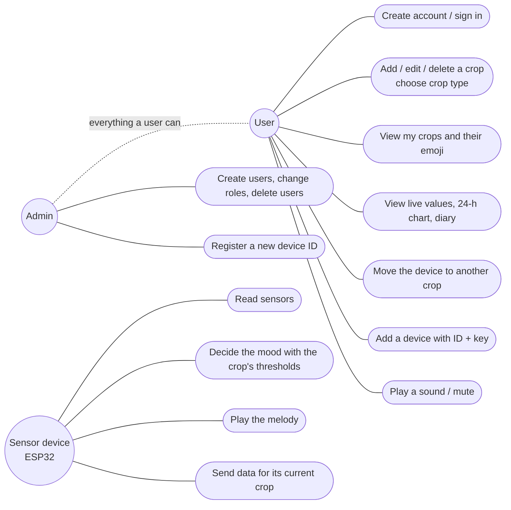
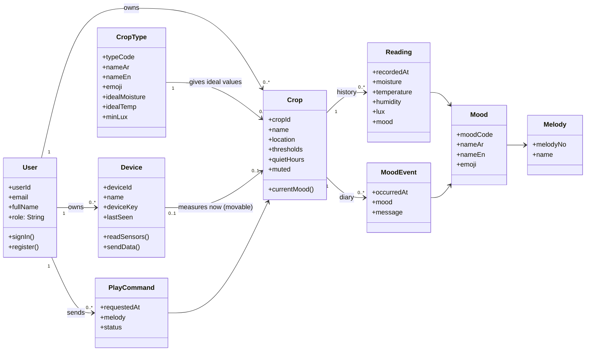
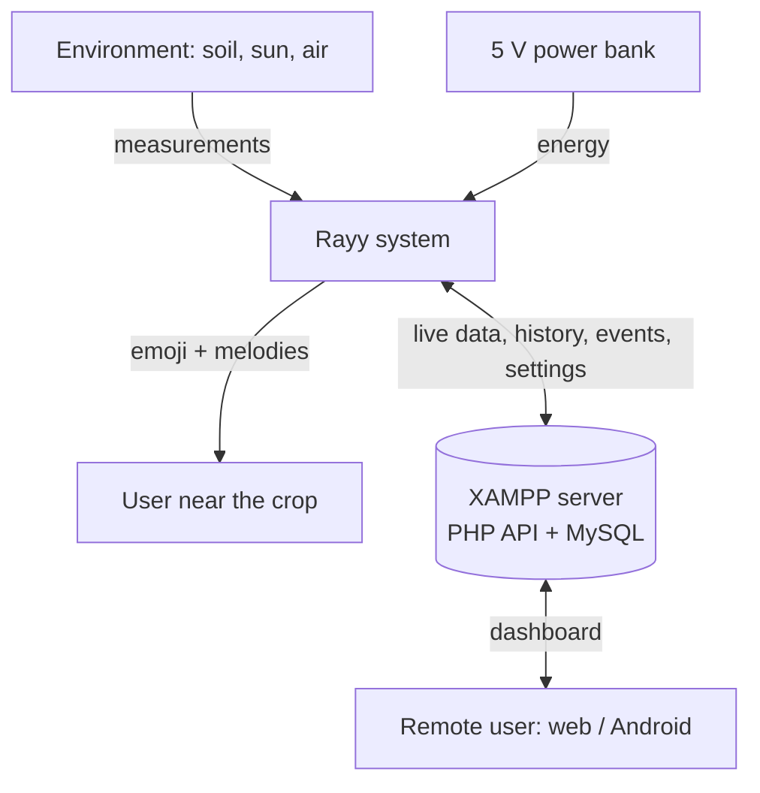

# 01 · Requirements and System Analysis

## 1.1 Project idea (from the proposal)

**ري (Rayy)** is a **smart-farming system** that **turns the feelings of crops into emoji and sound** using
**Internet of Things (IoT)** technology. It is not made for one plant: a farmer, a school or a family can manage
**many crops (زراعات)** in one account — for example a strawberry field in a greenhouse, tomatoes on a farm, mint
in a garden. A sensor device placed in a crop measures **soil moisture, light and temperature**, and ري turns them
into digital **facial expressions (emoji)** and **sound alerts (melodies)** for the **whole crop**.

* Every crop has a **crop type** (strawberry, tomato, cucumber, mint, date palm, cactus …) that gives its **ideal
  values**; the user can adjust them.
* The graduation project uses **one sensor device**. It can be **moved from one crop to another** from the apps;
  the history of every crop is kept.
* Anyone can **create an account** from the web or the Android app; an **admin** manages all users.

> **Scope decision:** to focus on the main idea, the solar energy part of the original proposal is replaced by a
> simple **5 V USB power bank / charger**, and the sound is made by a **buzzer** that plays a different melody for each
> mood. (Update the proposal text with your supervisor if needed. Solar power is listed as future work.)

**Importance**

* **Smart farming:** it watches the watering and the environment of every crop so crops never reach drought,
  over-watering, heat or cold damage, and it saves water by watering only when needed.
* **Environmental awareness and smart interaction:** a fun, innovative way to "talk" with crops through IoT,
  emoji and sound alerts.
* **Learning value:** it combines sensors, embedded programming, cloud databases, web and mobile development in one system.

**Duration:** 6 weeks. **Team:** 6 members.

## 1.2 Objectives

1. Measure soil moisture, light intensity, air temperature and humidity of a crop automatically.
2. Show the state of **each crop** as an **emoji face** in the **web dashboard** and the **Android app** (no screen on the device).
3. Play **sound alerts**: a different buzzer melody for each mood (sad melody when thirsty, happy melody after watering…).
4. Save the data in a **MySQL database** (XAMPP server: Apache + PHP + MySQL) and show it on a **web dashboard** and an **Android app**.
5. Run from a simple **5 V USB power bank** (portable) or a USB charger.
6. Manage **many crops**: add a crop with its type (ideal values filled automatically), edit its thresholds, delete it.
7. **Move the sensor device** from one crop to another from the apps.
8. Let anyone **create an account** from the web or Android app; let the **admin** create users, change roles and delete users.
9. Mute the sound and play a sound on the device from the apps.

## 1.3 Why the ESP32 (and not the ESP8266)

| Need of this project | ESP32 | ESP8266 |
|---|---|---|
| Analog input for the soil sensor | ✅ 18 ADC channels (12-bit) | ⚠️ only **1** ADC pin (10-bit, 0–1 V on some boards) |
| HTTP / JSON networking memory | ✅ 520 KB RAM | ⚠️ 80 KB, often unstable with TLS |
| PWM for buzzer melodies, I2C, many GPIO | ✅ plenty | ⚠️ few free pins |
| Dual-core CPU (smooth face animation + Wi-Fi) | ✅ 240 MHz × 2 | ❌ single core 80 MHz |
| Price | ~ same | ~ same |

➡️ **Use the ESP32 DevKit V1 (ESP-WROOM-32).**

## 1.4 Functional requirements

| ID | Requirement |
|---|---|
| FR-1 | The system shall read soil moisture (%) every 2 seconds. |
| FR-2 | The system shall read light intensity (lux), air temperature (°C) and humidity (%). |
| FR-3 | The system shall decide the crop mood, using the thresholds of the crop the device is assigned to: *happy, thirsty, drowning (too wet), hot, cold, needs light, sleeping*. |
| FR-4 | The web and Android apps shall display the emoji face of the current mood. |
| FR-5 | The system shall play a buzzer melody when the mood changes, and repeat a complaint every 30 min (configurable). |
| FR-6 | The system shall stay silent during quiet hours (default 22:00–07:00) and when muted. |
| FR-7 | The system shall upload the live readings to the server (PHP API → MySQL) every 30 s, a history point every 5 min, and an event on each mood change. |
| FR-8 | The system shall keep showing the face and playing sounds when there is no internet (offline mode). |
| FR-9 | The system shall report its Wi-Fi signal strength and online/offline status. |
| FR-10 | The web and Android apps shall require a login (email + password). |
| FR-11 | The apps shall show the emoji mood, all live values, online/offline status, last-update time. |
| FR-12 | The apps shall show a 24-hour history chart and the "crop diary" (list of mood changes) of each crop. |
| FR-13 | The apps shall let the user play a chosen melody on the crop's device ("Play") and mute it. |
| FR-14 | The apps shall let the user edit a crop's name, type, location, thresholds (moisture, temperature, light) and quiet hours. |
| FR-15 | The apps shall support Arabic and English. |
| FR-16 | A push button on the device plays the current mood's melody. |
| FR-17 | The system shall manage many crops per user; each crop has a type from a crop library (12 types) with ideal values. |
| FR-18 | The apps shall show a list of the user's crops with the emoji, main values and device of each crop. |
| FR-19 | The user shall be able to move a sensor device to another crop (or unassign it); readings then belong to the new crop and the device uses its thresholds. |
| FR-20 | Anyone shall be able to create a user account from the web or Android app. |
| FR-21 | An admin shall be able to create users (user or admin), change roles and delete users; an admin sees all crops and devices. |
| FR-22 | A user shall be able to add a device with its device ID and key; only an admin can register a new device ID. |

## 1.5 Non-functional requirements

| ID | Requirement |
|---|---|
| NFR-1 | **Availability:** the face and sounds must work even without Wi-Fi/internet (local decision on the ESP32). |
| NFR-2 | **Energy:** low consumption (≈ 0.5 W); ≥ 2 days on a 10,000 mAh power bank. |
| NFR-3 | **Security:** only signed-in users (token) can read or change data through the PHP API; the ESP32 uses a device key; passwords are stored as bcrypt hashes; all SQL uses prepared statements. |
| NFR-4 | **Performance:** live data appears in the apps less than 35 s after a change. |
| NFR-5 | **Usability:** the apps are simple, bilingual, and work on phones (responsive design). |
| NFR-6 | **Cost:** total hardware cost around 150–340 SAR. |
| NFR-7 | **Maintainability:** clear modular code, configuration in one file (`config.h`). |
| NFR-8 | **Safety:** only safe low voltage (5 V USB). The electronics are protected from water in a box. |

## 1.6 Hardware requirements (summary; details in [02](02-hardware-bom.md))

ESP32 DevKit V1 · capacitive soil moisture sensor v1.2 · BH1750 light sensor · DHT22 temperature/humidity
sensor · passive buzzer + 100 Ω resistor · push button · breadboard + wires ·
5 V USB power bank (or USB charger) · small enclosure.

## 1.7 Software requirements

| Part | Tool / technology |
|---|---|
| Firmware | Arduino IDE 2.x + "esp32 by Espressif" core 3.x, C++ |
| Arduino libraries | DHT sensor library, Adafruit Unified Sensor, BH1750 (Christopher Laws), ArduinoJson 7 |
| Server / database | **XAMPP**: Apache 2.4 web server, **PHP 8** (PDO) API, **MySQL / MariaDB** database, phpMyAdmin |
| Web app | HTML5, CSS3, JavaScript (ES modules, `fetch`), Chart.js 4 (included locally) |
| Android app | Android Studio (Panda or newer), Kotlin, Jetpack Compose (Material 3), coroutines, HttpURLConnection + org.json |
| Tools | phpMyAdmin (in XAMPP), VS Code, Git (optional) |

## 1.8 Users and use cases

| Actor | Who | Can do |
|---|---|---|
| **User** (farmer, student, family) | Creates an account from the web or Android app | Manage **own** crops and devices |
| **Admin** | Created by `rayy.sql` or by another admin | Everything a user can + see **all** crops/devices, create users, change roles, delete users, register new devices |
| **Sensor device** (ESP32) | `rayy-01` | Measure the crop it is assigned to, decide the mood, play melodies, send data |

### Class diagram (domain model)

## 1.9 Mood rules (the "brain" of the device)

Rules are checked **in this order** (the first that matches wins). The thresholds are those of the **crop the device is assigned to** (they come from its crop type and can be changed in the apps).

| Priority | Condition (defaults) | Mood | Face | Melody |
|---|---|---|---|---|
| 1 | soil moisture < 30 % | Thirsty | 😫 | 1: sad "help!" notes (played twice) |
| 2 | soil moisture > 85 % | Too wet (drowning) | 🥴 | 2: fast "bubbling" notes |
| 3 | temperature > 35 °C | Hot | 🥵 | 3: alarm beeps |
| 4 | temperature < 10 °C | Cold | 🥶 | 4: "shivering" trill |
| 5 | night (18:00–06:00) | Sleeping | 😴 | 8: lullaby (once) |
| 6 | day and light < 200 lux | Needs light | 😞 | 5: "where is the sun?" |
| 7 | otherwise | Happy | 😊 | 6: happy arpeggio / 7: joyful "thank you" after watering |

* **Hysteresis:** a problem is "solved" only when the value is better by a margin (5 % moisture, 1 °C, 50 lux).
  This stops the face from flickering around a threshold.
* **Sound:** a melody plays when the mood changes. A complaint repeats every 30 min. The device is silent during quiet hours or when the crop is muted.
  Melody 9 is the start-up "hello".

## 1.10 Context diagram

