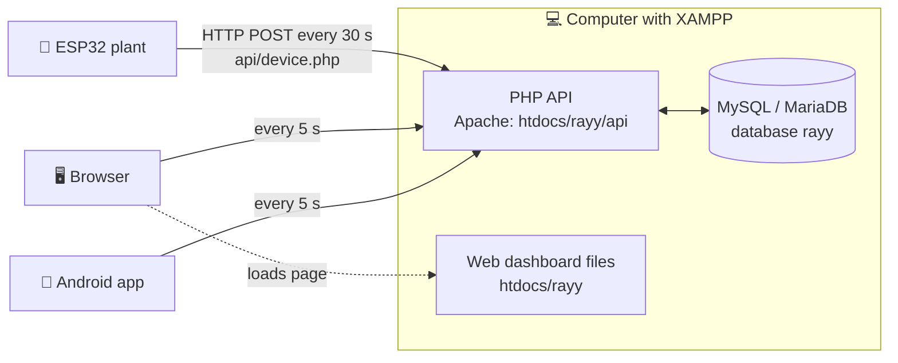
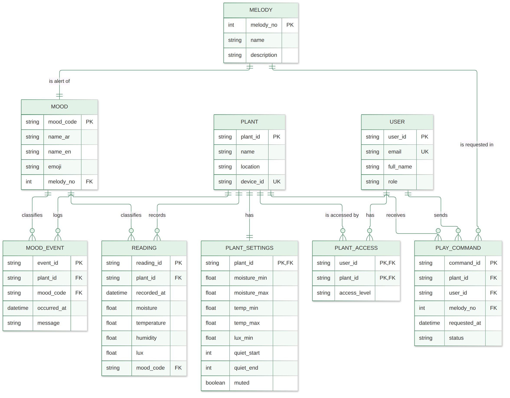

# 04 · Database: MySQL with XAMPP (Apache + PHP)

## 4.1 Can the project use MySQL and XAMPP? Yes

All the requirements (live readings, 24-hour history, plant diary, settings from the apps, "Play" button, login,
Arabic/English web and Android apps) work with **MySQL + Apache + PHP** from **XAMPP**. The only difference is
*how* the parts talk to each other:



* The **ESP32** sends one HTTP request every 30 s: the live values (+ a history point every 5 min, + a diary event
  when the mood changes). The answer brings back the **settings** and any **"Play"** command.
* The **web dashboard** and the **Android app** ask the API for new data every **5 seconds** (polling).
* **MySQL never talks to the outside directly**: only the PHP API reads and writes it, with prepared statements.

### Firebase version vs XAMPP version

| | Firebase (other version) | **MySQL + XAMPP (this version)** |
|---|---|---|
| Where the data lives | Google cloud | **Your computer** (C:\xampp\mysql) |
| Internet needed | Yes | **No**: a local Wi-Fi is enough |
| Computer must stay on | No | **Yes**, during use and the demo |
| Access from anywhere | Yes | Only in the same Wi-Fi (or with port forwarding / online hosting) |
| Real-time updates | Instant (push) | Every 5 s (polling), good enough for a plant |
| Server code to write | None (rules only) | **PHP API** (included: `server/rayy/api`) |
| Database type | NoSQL (JSON tree) | **Relational SQL**: the tables of the ERD (3NF), foreign keys, SQL queries |
| Cost | Free plan | Free |
| Good for the report | Cloud / NoSQL | **ERD, normalization and SQL map 1-to-1 to real tables** |

## 4.2 Database tables (database `rayy`)

The tables are exactly the ERD / relational model of the report, plus `live_status` (latest values) and
`api_tokens` (login sessions). Script: [`database/rayy.sql`](../database/rayy.sql).

| Table | Primary key | What it stores | Written by | Read by |
|---|---|---|---|---|
| `users` | user_id | App users; password stored as **bcrypt hash** | phpMyAdmin / SQL | login.php |
| `plants` | plant_id | Each ESP32 plant; **SHA-256 of the device key** | SQL | device.php |
| `plant_access` | (user_id, plant_id) | Which user may see which plant | SQL | all app APIs |
| `plant_settings` | plant_id | Thresholds, quiet hours, mute | settings.php (apps) | device.php (ESP32), apps |
| `melodies` | melody_no | The 9 buzzer melodies (fixed data) | rayy.sql | reports |
| `moods` | mood_code | 7 moods: Arabic/English name, emoji, melody (fixed data) | rayy.sql | FK checks, reports |
| `live_status` | plant_id | Latest values, overwritten every 30 s | device.php | live.php |
| `readings` | reading_id | History, one row every 5 min | device.php | history.php |
| `mood_events` | event_id | Plant diary (mood changes) | device.php | events.php |
| `play_commands` | command_id | "Play" requests: pending → played | command.php | device.php |
| `api_tokens` | token_hash | Login sessions of the apps (7 days) | login.php | all app APIs |



## 4.3 The PHP API (`server/rayy/api`)

All answers are JSON `{"ok": true, ...}` or `{"ok": false, "error": "..."}`. Every request has `?plant=plant01`.

| File | Method | Who calls it | Security | What it does |
|---|---|---|---|---|
| `device.php` | POST | ESP32 every 30 s | header **X-Device-Key** | Saves live (+ history + event), returns settings, the next "Play" melody and the server hour |
| `login.php` | POST | Web, Android | email + password | Checks the bcrypt password, returns a **token** |
| `logout.php` | POST | Web, Android | token | Deletes the session |
| `live.php` | GET | Web, Android every 5 s | header **X-Auth-Token** | Latest values + settings |
| `history.php` | GET | Web, Android every 5 min | token | Points of the last 24 h (chart) |
| `events.php` | GET | Web, Android every 15 s | token | Last 30 diary entries |
| `settings.php` | POST | Web (settings form), Android (mute) | token | Changes only the fields sent, checks the ranges |
| `command.php` | POST | Web, Android ("Play") | token | Adds a pending melody 1–9 |
| `config.php` | — | — | — | **Database settings** (host, user `root`, empty password) |
| `lib.php` | — | — | — | Shared code: connection (PDO), JSON, token checks |

Example (ESP32 → server):

```http
POST /rayy/api/device.php?plant=plant01
X-Device-Key: rayy-device-key-2026
Content-Type: application/json

{"moisture":46,"temperature":27.4,"humidity":38,"lux":5400,"mood":"happy","soil_raw":2190,
 "rssi":-61,"ip":"192.168.1.23","uptime_s":86400,"history":true,
 "event":{"mood":"happy","message":"I am happy, everything is perfect!"}}
```

Answer:

```json
{"ok":true,"config":{"name":"ري 🌿","moisture_min":30,"moisture_max":85,"temp_min":10,"temp_max":35,
 "lux_min":200,"quiet_start":22,"quiet_end":7,"muted":false},"play":0,"hour":14}
```

## 4.4 Step-by-step setup (≈ 20 minutes)

### Step 1: Install and start XAMPP
1. Download XAMPP for Windows (PHP 8.x) from <https://www.apachefriends.org> and install it in `C:\xampp`.
2. Open the **XAMPP Control Panel** → **Start** Apache and **Start** MySQL. Both must turn **green**.
3. If Apache does not start ("port 80 in use", often by Skype/IIS): **Config → Apache (httpd.conf)** → change
   `Listen 80` to `Listen 8080`; then every address becomes `http://<ip>:8080/rayy/...`.

### Step 2: Copy the website + API
Copy the folder `server/rayy` into `C:\xampp\htdocs\`:

```
C:\xampp\htdocs\rayy\
   index.html  style.css  app.js  lib\chart.umd.min.js     ← web dashboard
   api\config.php  lib.php  device.php  login.php  ...      ← PHP API
```

### Step 3: Create the database
1. Open <http://localhost/phpmyadmin>.
2. Tab **Import** → **Choose file** → `database/rayy.sql` → **Import** (bottom of the page).
3. On the left you now see the database **rayy** with **11 tables**.

The script also creates:

| What | Value | Change it? |
|---|---|---|
| Plant | `plant01`, device key **`rayy-device-key-2026`** | Yes for a real deployment: change it in `rayy.sql` **and** `config.h` |
| User | **`team@rayy.app`** / **`Rayy@2026`** | Yes: see 4.6 |

### Step 4: Database password (only if you set one)
XAMPP's MySQL user is `root` with an **empty password**. If you set a password, write it in
`C:\xampp\htdocs\rayy\api\config.php` (`DB_PASS`).

### Step 5: Allow other devices in the same Wi-Fi
1. Find the computer IP: **cmd → `ipconfig`** → IPv4 Address (e.g. `192.168.1.10`).
2. **Windows Defender Firewall** → allow **Apache HTTP Server** on **Private** networks (Windows asks the first time).
3. Set the Wi-Fi network on the computer to **Private** (Settings → Network → Wi-Fi → properties).
4. Tip: in the router, reserve this IP for the computer (DHCP reservation) so it does not change.

✅ **Check:** from the phone's browser open `http://192.168.1.10/rayy/` → the login page appears.

### Step 6: Test the API without the ESP32 (optional)
In **cmd** on the computer:

```bat
curl -X POST "http://localhost/rayy/api/device.php?plant=plant01" -H "X-Device-Key: rayy-device-key-2026" -H "Content-Type: application/json" -d "{\"moisture\":20,\"temperature\":27,\"humidity\":40,\"lux\":3000,\"mood\":\"thirsty\",\"history\":true}"
```

The answer is `{"ok":true,...}`, and the web dashboard shows 😫 "Thirsty" within 5 s.

## 4.5 Security

* **Passwords** are stored only as **bcrypt hashes** (`password_hash` / `password_verify`).
* **Login tokens** are random 64-character values; the database stores only their **SHA-256**. They expire after 7 days.
* The **ESP32** uses its own **device key**; it cannot read users or sessions.
* Every query uses **PDO prepared statements** → no SQL injection. Inputs are validated (ranges, mood names).
* **Foreign keys** and a **CHECK** constraint keep the data consistent.
* Users can only see plants listed for them in `plant_access`.
* Limitation: plain **http://** inside the local network (no certificate). For use over the internet, use online
  hosting with **https** (see 4.7).

## 4.6 Useful SQL (phpMyAdmin → SQL tab)

```sql
-- Add a user. First create the password hash in cmd:
--   C:\xampp\php\php.exe -r "echo password_hash('NewPassword1', PASSWORD_BCRYPT);"
-- then paste the result instead of $2y$10$... below
INSERT INTO users (email, full_name, password_hash) VALUES ('sara@rayy.app', 'Sara', '$2y$10$...');
INSERT INTO plant_access (user_id, plant_id) VALUES (LAST_INSERT_ID(), 'plant01');

-- Change a password
UPDATE users SET password_hash = '$2y$10$...' WHERE email = 'team@rayy.app';

-- Daily average moisture of the last week (for the report)
SELECT DATE(recorded_at) AS day, ROUND(AVG(moisture), 1) AS avg_moisture,
       MIN(temperature) AS min_temp, MAX(temperature) AS max_temp
FROM readings WHERE plant_id = 'plant01' AND recorded_at >= NOW() - INTERVAL 7 DAY
GROUP BY DATE(recorded_at) ORDER BY day;

-- How many times was the plant thirsty?
SELECT m.name_en, m.emoji, COUNT(*) AS times
FROM mood_events e JOIN moods m ON m.mood_code = e.mood_code
WHERE e.plant_id = 'plant01' GROUP BY m.mood_code ORDER BY times DESC;

-- Delete history older than 30 days
DELETE FROM readings WHERE recorded_at < NOW() - INTERVAL 30 DAY;
```

Export data for the report: select a table → **Export** → format **CSV for MS Excel**.

## 4.7 Using it outside the local Wi-Fi (optional)

* **Online PHP/MySQL hosting** (many have free plans): upload `server/rayy` with FTP, import `rayy.sql` with their
  phpMyAdmin, write their database user/password in `api/config.php`, and use `http(s)://your-domain/rayy/api` in
  `config.h` and `Model.kt`. (For `https://` the ESP32 code must use `WiFiClientSecure`.)
* Or a tunnel such as **ngrok** to the XAMPP computer, for a quick demo.

## 4.8 Common problems

| Problem | Solution |
|---|---|
| Apache will not start | Port 80 is used by another program: change `Listen 80` to `Listen 8080` (and add `:8080` to the URLs) |
| MySQL will not start | Another MySQL is running (port 3306): stop it in Windows Services, or change the port in `my.ini` and `config.php` |
| `Database connection failed` | MySQL is stopped, or the database was not imported, or a wrong password in `config.php` |
| Phone / ESP32 cannot open `http://192.168.x.x/rayy/` | Different Wi-Fi network, Windows Firewall blocking Apache, or the IP changed (`ipconfig` again) |
| ESP32: `[server] error -1` | Wrong `SERVER_URL` (localhost? missing `/rayy/api`?), or Apache stopped |
| ESP32: `[server] error 401` | `DEVICE_KEY` in `config.h` is different from the key in `rayy.sql` |
| Login says "Wrong email or password" | Use `team@rayy.app` / `Rayy@2026`, or reset the hash (4.6) |
| Arabic text shows as `???` | Import `rayy.sql` again with phpMyAdmin (it contains `SET NAMES utf8mb4`) |
