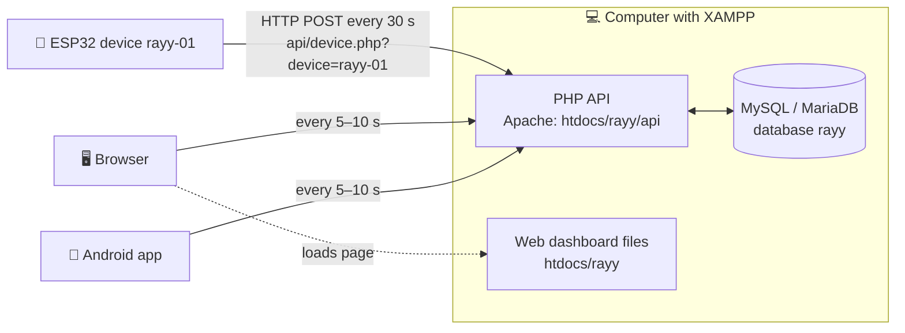
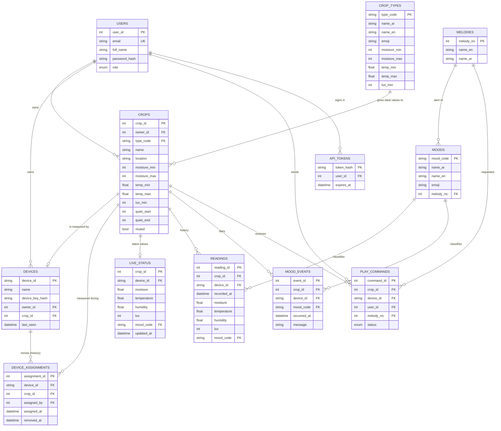

# 04 · Database: MySQL with XAMPP (Apache + PHP)

## 4.1 The idea: one system "ري" for many crops

**ري (Rayy)** is a smart-farming system, not a single plant. One account can manage **many crops (زراعات)**:
a strawberry field in a greenhouse, tomatoes on a farm, mint in a garden… The emoji shows how the **whole crop**
feels.

| Concept | Table | Example |
|---|---|---|
| **User** | `users` | Sara (user), the teacher (admin) |
| **Crop type** (library of ideal values) | `crop_types` | 🍓 Strawberry: moisture 60–85 %, 10–28 °C, ≥ 5000 lux |
| **Crop** (a planting the user manages) | `crops` | "Strawberry – greenhouse 1", type strawberry, its own thresholds |
| **Device** (the ESP32 sensor unit) | `devices` | `rayy-01`, now measuring "Strawberry – greenhouse 1" |
| **Device move history** | `device_assignments` | rayy-01 was on strawberries 1–10 Oct, then moved to mint |

* A new crop gets the **ideal values of its type** automatically; the user can still change them.
* The graduation project has **one device**. It is placed in a crop and chosen in the app; when it is **moved to
  another crop**, the readings go to the new crop and the ESP32 automatically uses the new crop's thresholds.
  The history of the old crop is kept.
* More devices can be added later (one per crop) with no change to the code.



### Firebase version vs XAMPP version

| | Firebase (other version) | **MySQL + XAMPP (this version)** |
|---|---|---|
| Where the data lives | Google cloud | **Your computer** (C:\xampp\mysql) |
| Internet needed | Yes | **No**: a local Wi-Fi is enough |
| Computer must stay on | No | **Yes**, during use and the demo |
| Access from anywhere | Yes | Only in the same Wi-Fi (or with online hosting, 4.7) |
| Real-time updates | Instant (push) | Every 5 s (polling), good enough for crops |
| Database type | NoSQL (JSON tree) | **Relational SQL**: ERD, normalization and SQL map 1-to-1 to real tables |
| Cost | Free plan | Free |

## 4.2 Tables (database `rayy`, 12 tables, 3NF)

Script: [`database/rayy.sql`](../database/rayy.sql).

| Table | Primary key | What it stores |
|---|---|---|
| `users` | user_id | Users; password as **bcrypt hash**; role `admin` or `user` |
| `crop_types` | type_code | Library: 12 crop types with Arabic/English name, emoji and ideal values |
| `crops` | crop_id | The crops: owner, type, name, location, thresholds, quiet hours, mute |
| `devices` | device_id | ESP32 units: **SHA-256 of the device key**, owner, **crop it measures now**, last seen |
| `device_assignments` | assignment_id | History of moves: device, crop, who moved it, from, until |
| `live_status` | crop_id | Latest values of each crop (overwritten every 30 s) |
| `readings` | reading_id | History of each crop, one row every 5 min (24-hour chart) |
| `mood_events` | event_id | Crop diary: one row per mood change |
| `play_commands` | command_id | "Play" requests from the apps: pending → played |
| `moods` | mood_code | 7 moods: names, emoji, melody (fixed data) |
| `melodies` | melody_no | 9 buzzer melodies (fixed data) |
| `api_tokens` | token_hash | Login sessions of the apps (7 days) |



## 4.3 The PHP API (`server/rayy/api`)

All answers are JSON `{"ok": true, ...}` or `{"ok": false, "error": "..."}`. The apps send the login token in the
header **`X-Auth-Token`**; the ESP32 sends its key in **`X-Device-Key`**.

| File | Method | Who | What it does |
|---|---|---|---|
| `register.php` | POST | anyone (web, Android) | **Create an account** (role `user`) and sign in |
| `login.php` / `logout.php` / `me.php` | POST / POST / GET | web, Android | Sign in → token; sign out; who am I |
| `crop_types.php` | GET | anyone | The crop library (for the "add crop" form) |
| `crops.php` | GET / POST | user | My crops with mood, values and device (admin: all crops) / **add a crop** |
| `crop_update.php?crop=ID` | POST | owner, admin | Change name, type (loads its ideal values), location, thresholds, mute |
| `crop_delete.php?crop=ID` | POST | owner, admin | Delete a crop (its device becomes free) |
| `live.php?crop=ID` | GET | owner, admin | Latest values + settings + device of one crop (every 5 s) |
| `history.php?crop=ID` | GET | owner, admin | Points of the last 24 h |
| `events.php?crop=ID` | GET | owner, admin | Diary of the crop |
| `command.php?crop=ID` | POST | owner, admin | "Play" melody 1–9 on the crop's device |
| `devices.php` | GET / POST | user | My devices (admin: all) / **add a device** with its ID + key (admin: register a new ID) |
| `device_assign.php` | POST | device owner, admin | **Move a device to another crop** (or unassign it) |
| `users.php` | GET / POST | **admin only** | List users / **create user** (any role) / change role / delete user |
| `device.php?device=ID` | POST | the ESP32 | Saves live (+ history + event) **for the crop the device is on now**; answers with that crop's thresholds, the next "Play" melody and the server hour |
| `config.php`, `lib.php` | — | — | Database settings; shared code (PDO, JSON, token and permission checks) |

**Permissions:** a user sees and changes only **their own** crops and devices. An **admin** sees everything and
manages users. Anyone can create a `user` account; only an admin can create another admin.

Example (ESP32 → server):

```http
POST /rayy/api/device.php?device=rayy-01
X-Device-Key: rayy-device-key-2026
Content-Type: application/json

{"moisture":46,"temperature":27.4,"humidity":38,"lux":5400,"mood":"happy","soil_raw":2190,
 "rssi":-61,"ip":"192.168.1.23","uptime_s":86400,"history":true}
```

Answer (the device is on the strawberry crop):

```json
{"ok":true,"crop":{"crop_id":1,"name":"فراولة البيت المحمي"},
 "config":{"name":"فراولة البيت المحمي","location":"Greenhouse 1","type_code":"strawberry","moisture_min":60,
 "moisture_max":85,"temp_min":10,"temp_max":28,"lux_min":5000,"quiet_start":22,"quiet_end":7,"muted":false},
 "play":0,"hour":14}
```

If the device is not assigned to any crop, the answer is `"crop":null` and nothing is saved.

## 4.4 Step-by-step setup (≈ 20 minutes)

### Step 1: Install and start XAMPP
1. Download XAMPP for Windows (PHP 8.x) from <https://www.apachefriends.org> and install it in `C:\xampp`.
2. Open the **XAMPP Control Panel** → **Start** Apache and **Start** MySQL. Both must turn **green**.
3. If Apache does not start ("port 80 in use", often by Skype/IIS): **Config → Apache (httpd.conf)** → change
   `Listen 80` to `Listen 8080`; then every address becomes `http://<ip>:8080/rayy/...`.

### Step 2: Copy the website + API
Copy the folder `server/rayy` into `C:\xampp\htdocs\` so that you get **`C:\xampp\htdocs\rayy\index.html`**:

```
C:\xampp\htdocs\rayy\
   index.html  style.css  app.js  lib\chart.umd.min.js     ← web dashboard
   api\config.php  lib.php  device.php  login.php  ...      ← PHP API
```

⚠️ If <http://localhost/rayy/> says **Not Found**, the folder is in the wrong place (for example
`htdocs\Rayy-Project-MySQL\...` or `htdocs\rayy\rayy\...`).

### Step 3: Create the database
1. Open <http://localhost/phpmyadmin>.
2. Tab **Import** → **Choose file** → `database/rayy.sql` → **Import** (bottom of the page).
3. On the left you now see the database **rayy** with **12 tables**. (Importing again resets all data.)

The script also creates:

| What | Value | Change it? |
|---|---|---|
| Admin user | **`admin@rayy.app`** / **`Rayy@2026`** | Yes: change the password (4.6) |
| Crop types | 12 types (strawberry, tomato, cucumber, pepper, lettuce, mint, basil, date palm, rose, cactus, indoor plant, other) | Add your own with SQL (4.6) |
| Example crops | "فراولة البيت المحمي" (strawberry), "نعناع الحديقة" (mint) | Delete or rename them in the app |
| Device | **`rayy-01`**, key **`rayy-device-key-2026`**, on the strawberry crop | For a real deployment change the key in `rayy.sql` **and** `config.h` |

### Step 4: Database password (only if you set one)
XAMPP's MySQL user is `root` with an **empty password**. If you set a password, write it in
`C:\xampp\htdocs\rayy\api\config.php` (`DB_PASS`).

### Step 5: Allow other devices in the same Wi-Fi
1. Find the computer IP: **cmd → `ipconfig`** → IPv4 Address (e.g. `192.168.1.10`).
2. **Windows Defender Firewall** → allow **Apache HTTP Server** on **Private** networks (Windows asks the first time).
3. Set the Wi-Fi network on the computer to **Private** (Settings → Network → Wi-Fi → properties).
4. Tip: in the router, reserve this IP for the computer (DHCP reservation) so it does not change.

✅ **Check:** from the phone's browser open `http://192.168.1.10/rayy/` → the login page appears.

### Step 6: Test the API without the ESP32 (optional)
In **cmd** on the computer:

```bat
curl -X POST "http://localhost/rayy/api/device.php?device=rayy-01" -H "X-Device-Key: rayy-device-key-2026" -H "Content-Type: application/json" -d "{\"moisture\":20,\"temperature\":27,\"humidity\":40,\"lux\":3000,\"mood\":\"thirsty\",\"history\":true}"
```

The answer is `{"ok":true,...}`, and the strawberry crop shows 😫 "Thirsty" in the apps within 5 s.

**Full automatic test:** `bash tests/test_api.sh http://localhost/rayy/api` (in Git Bash) runs **44 checks**
(accounts, crops, devices, moving the device, permissions). Import `rayy.sql` again before and after it.

## 4.5 Security

* **Passwords** are stored only as **bcrypt hashes** (`password_hash` / `password_verify`), minimum 8 characters.
* **Login tokens** are random 64-character values; the database stores only their **SHA-256**. They expire after 7 days.
* The **ESP32** uses its own **device key** (stored as SHA-256); it can only send data for its current crop.
* A user can only see and change **their own** crops and devices; **admins** manage everything.
* Every query uses **PDO prepared statements** → no SQL injection. Inputs are validated (ranges, names, emails).
* **Foreign keys** (with `ON DELETE CASCADE / SET NULL`), **transactions** and a **CHECK** constraint keep the data consistent.
* Limitation: plain **http://** inside the local network (no certificate). For use over the internet, use online
  hosting with **https** (see 4.7).

## 4.6 Useful SQL (phpMyAdmin → SQL tab)

```sql
-- Change a password. First create the hash in cmd:
--   C:\xampp\php\php.exe -r "echo password_hash('NewPassword1', PASSWORD_BCRYPT);"
UPDATE users SET password_hash = '$2y$10$...' WHERE email = 'admin@rayy.app';

-- Add a crop type to the library
INSERT INTO crop_types (type_code, name_ar, name_en, emoji, moisture_min, moisture_max, temp_min, temp_max, lux_min)
VALUES ('eggplant', 'باذنجان', 'Eggplant', '🍆', 55, 80, 18, 32, 7000);

-- Daily average of a crop over the last week (for the report)
SELECT DATE(recorded_at) AS day, ROUND(AVG(moisture), 1) AS avg_moisture,
       MIN(temperature) AS min_temp, MAX(temperature) AS max_temp
FROM readings WHERE crop_id = 1 AND recorded_at >= NOW() - INTERVAL 7 DAY
GROUP BY DATE(recorded_at) ORDER BY day;

-- How often was each crop thirsty?
SELECT c.name, COUNT(*) AS thirsty_times
FROM mood_events e JOIN crops c ON c.crop_id = e.crop_id
WHERE e.mood_code = 'thirsty' GROUP BY c.crop_id ORDER BY thirsty_times DESC;

-- Where was the device, and when? (moves between crops)
SELECT a.device_id, c.name AS crop, a.assigned_at, a.removed_at
FROM device_assignments a JOIN crops c ON c.crop_id = a.crop_id ORDER BY a.assigned_at;

-- Delete history older than 30 days
DELETE FROM readings WHERE recorded_at < NOW() - INTERVAL 30 DAY;
```

Export data for the report: select a table → **Export** → format **CSV for MS Excel**.

## 4.7 Using it outside the local Wi-Fi (optional)

* **Online PHP/MySQL hosting** (many have free plans): upload `server/rayy` with FTP, import `rayy.sql` with their
  phpMyAdmin, write their database user/password in `api/config.php`, and use `http(s)://your-domain/rayy/api` in
  `config.h` and `Model.kt`. (For `https://` the ESP32 code must use `WiFiClientSecure`.)
* Or a tunnel such as **ngrok** to the XAMPP computer, for a quick demo.

## 4.8 Common problems

| Problem | Solution |
|---|---|
| `http://localhost/rayy/` → **Not Found** | The folder is not at `C:\xampp\htdocs\rayy\index.html` (see Step 2) |
| Apache will not start | Port 80 is used by another program: change `Listen 80` to `Listen 8080` (and add `:8080` to the URLs) |
| MySQL will not start | Another MySQL is running (port 3306): stop it in Windows Services, or change the port in `my.ini` and `config.php` |
| `Database connection failed` | MySQL is stopped, or the database was not imported, or a wrong password in `config.php` |
| Phone / ESP32 cannot open `http://192.168.x.x/rayy/` | Different Wi-Fi network, Windows Firewall blocking Apache, or the IP changed (`ipconfig` again) |
| ESP32: `[server] error -1` | Wrong `SERVER_URL` (localhost? missing `/rayy/api`?), or Apache stopped |
| ESP32: `[server] error 401` | `DEVICE_ID` / `DEVICE_KEY` in `config.h` do not match the `devices` table |
| ESP32: "not assigned to a crop yet" | Open the app → the crop → "Move to this crop", or Devices → Move |
| Crop shows "No data yet" | No device is on this crop: move the device to it |
| Login says "Wrong email or password" | Use `admin@rayy.app` / `Rayy@2026`, or reset the hash (4.6) |
| Arabic text shows as `???` | Import `rayy.sql` again with phpMyAdmin (it contains `SET NAMES utf8mb4`) |
