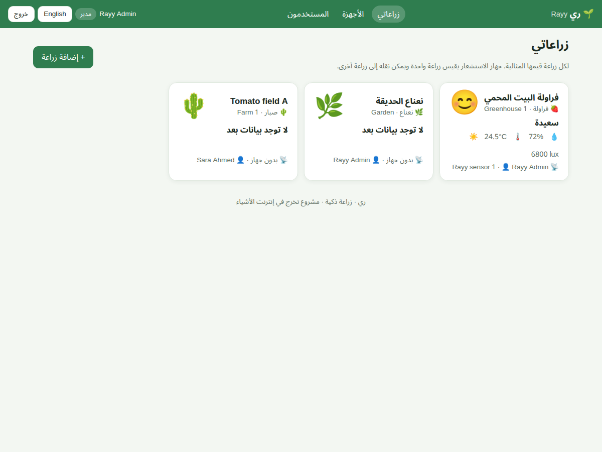
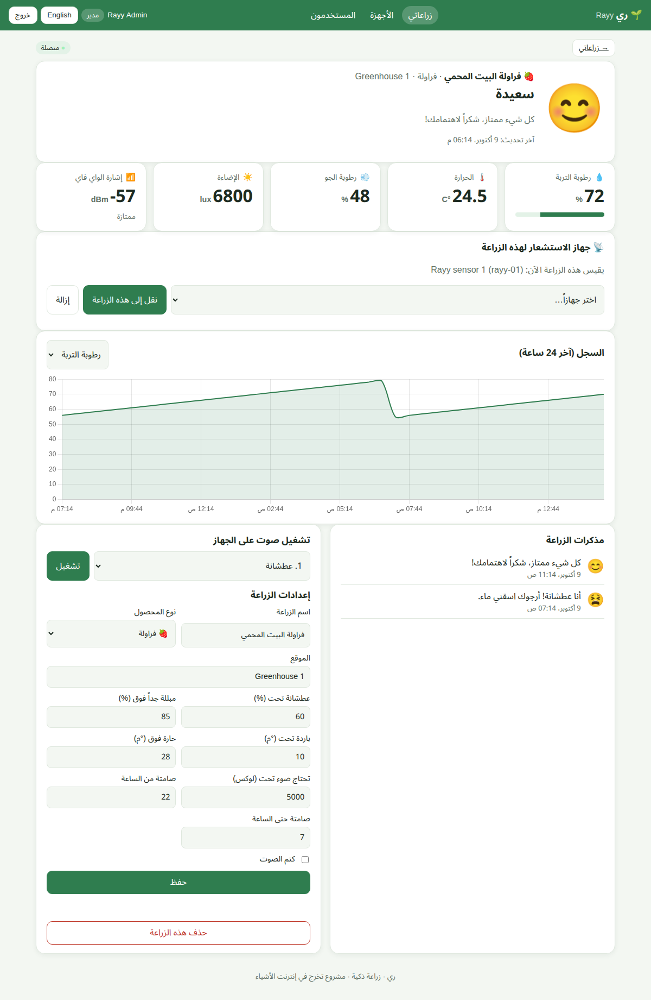
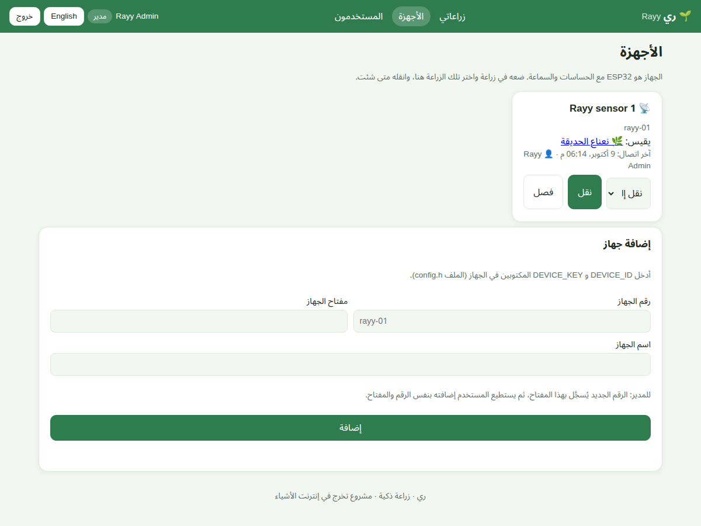
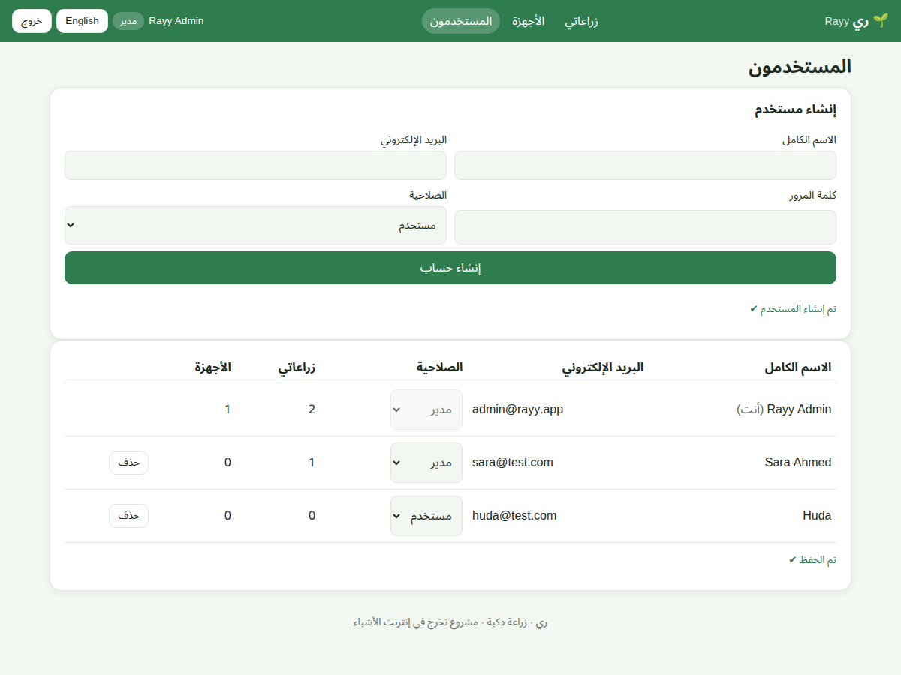

# 06 · Web Application (Dashboard)

Code: [`server/rayy/`](../server/rayy): `index.html`, `style.css`, `app.js`, `lib/chart.umd.min.js`, and the PHP API in
`api/`. No build step is needed: it is plain HTML/CSS/JavaScript served by **Apache (XAMPP)** from
`C:\xampp\htdocs\rayy`. The name of the application is always **ري (Rayy)**; inside it each user manages many crops.

## 6.1 Pages

| Page (address) | Who | What you can do |
|---|---|---|
| **Sign in / Create account** | everyone | Sign in, or create a new account (name, email, password ≥ 8 characters) |
| **My crops** (`#crops`) | user, admin | Cards of all my crops: emoji of the current feeling, crop type, location, moisture / temperature / light, the device on it. **+ Add crop**: name, **crop type** (shows its ideal values), location. The admin sees **all** crops with their owner |
| **Crop page** (`#crop/1`) | owner, admin | Big emoji + message, live values, **sensor device of this crop** (move a device here / remove it), 24-hour chart, crop diary, play a melody, **crop settings** (name, type, location, thresholds, quiet hours, mute; choosing a type fills its ideal values), delete the crop |
| **Devices** (`#devices`) | user, admin | Each device: which crop it measures, last connection, **Move to** another crop / unassign. **Add a device** with its ID + key (admin: register a new device ID) |
| **Users** (`#users`) | **admin only** | **Create a user** (user or admin), change roles, delete users; number of crops and devices per user |

Also: **Arabic (RTL) / English** switch, **dark mode** automatic, **responsive** on phones, a red banner when the
server cannot be reached, and **demo mode** (open `index.html` directly or add `?demo=1`).

## 6.2 Open it

| From | Address |
|---|---|
| The XAMPP computer | <http://localhost/rayy/> |
| A phone / laptop in the same Wi-Fi | `http://192.168.1.10/rayy/` (the computer's IP, see `ipconfig`) |
| Demo (no server) | open `index.html` directly, or add `?demo=1` |

First sign-in: `admin@rayy.app` / `Rayy@2026` (created by `database/rayy.sql`). New users press **Create account**.

## 6.3 How the code works (`app.js`)

* **Routing:** the part after `#` in the address chooses the page (`#crops`, `#crop/3`, `#devices`, `#users`), so the
  browser's back button works.
* **API calls:** `realCall()` uses `fetch()` and sends the login token in the header **`X-Auth-Token`** (the token is
  kept in the browser, so a refresh does not ask to sign in again). On HTTP 401 the page goes back to sign-in.
* **Polling:** *My crops* refreshes every **10 s**; an open crop refreshes `live.php` every **5 s**, `events.php` every
  **15 s** and `history.php` every **5 min**. The settings form is refilled only when the settings really changed.
* **Crop types:** loaded once from `crop_types.php`; choosing a type fills its ideal values in the form.
* **Demo mode:** `demoServer()` is a small fake API inside the browser with three crops, used when there is no server.
* All texts are in the `TEXT.ar` / `TEXT.en` dictionaries; all user text is escaped before it is shown (no HTML injection).

## 6.4 How the PHP API works

See [04 · Database](04-database-mysql-xampp.md) §4.3 for every file. In short, each PHP file:
1. includes `lib.php` (database connection with **PDO**, JSON helpers, token and permission checks),
2. checks the method (GET/POST), the login token, and that the user owns the crop / device (or is admin),
3. runs **prepared SQL statements** on MySQL (inside a **transaction** when several tables change),
4. returns JSON.
