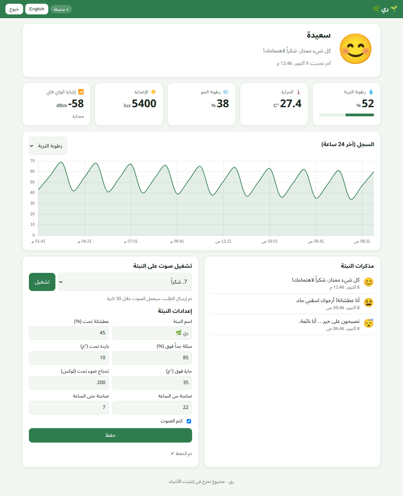

# 06 · Web Application (Dashboard)

Code: [`server/rayy/`](../server/rayy): `index.html`, `style.css`, `app.js`, `lib/chart.umd.min.js`, and the PHP API in
`api/`. No build step is needed: it is plain HTML/CSS/JavaScript served by **Apache (XAMPP)** from
`C:\xampp\htdocs\rayy`.

## 6.1 Features

* **Login** with email + password, checked by `api/login.php` against the MySQL table `users` (bcrypt hash).
  The browser keeps the login token, so a page refresh does not ask again.
* **Mood card:** big animated emoji, title and message. It turns orange when the plant needs something.
* **Live cards:** soil moisture (with bar), temperature, air humidity, light (lux), Wi-Fi signal.
* **Online / offline badge:** online if the plant sent data during the last 2 minutes.
* **History chart (24 h)** with a selector: moisture / temperature / humidity / light (Chart.js, included locally,
  so the page works **without internet**).
* **Plant diary:** the last 30 mood changes, with time.
* **Play a sound on the plant:** choose a melody → "Play". The plant's buzzer plays it within 30 s.
* **Plant settings:** name, thresholds, quiet hours, mute. They are saved in MySQL and the ESP32 applies them.
* **Arabic (RTL) / English** switch, **dark mode** automatic, **responsive** on phones.
* **Server error banner** when Apache/MySQL cannot be reached.
* **Demo mode** with simulated data (no server needed), useful for designing and presenting.

## 6.2 Open it

| From | Address |
|---|---|
| The XAMPP computer | <http://localhost/rayy/> |
| A phone / laptop in the same Wi-Fi | `http://192.168.1.10/rayy/` (the computer's IP, see `ipconfig`) |
| Demo (no server) | open `index.html` directly, or add `?demo=1` |

Sign in with `team@rayy.app` / `Rayy@2026` (created by `database/rayy.sql`).

## 6.3 Settings in the code

* `app.js`: `const API = "api"` (the API folder next to the page) and `const PLANT_ID = "plant01"` (same as the firmware).
* `api/config.php`: MySQL host, database name, user and password.

## 6.4 How the code works (`app.js`)

* `apiSource()` talks to the PHP API with `fetch()` and sends the login token in the header **`X-Auth-Token`**.
  It **polls** the server: `live.php` every **5 s**, `events.php` every **15 s**, `history.php` every **5 min**.
  The settings form is refilled only when the settings really changed, so typing is not interrupted.
* If the token expires (HTTP 401), the page goes back to the login screen.
* `demoSource()` makes the same calls with simulated data.
* `renderLive()`, `renderChart()`, `renderEvents()` and `fillSettings()` update the page.
* `saveConfig()` → `POST api/settings.php`, `speak(n)` → `POST api/command.php {play: n}` (melody 1–9).
* All the texts are in the `TEXT.ar` / `TEXT.en` dictionaries, so translation is easy.

## 6.5 How the PHP API works

See [04 · Database](04-database-mysql-xampp.md) §4.3 for every file. In short, each PHP file:
1. includes `lib.php` (database connection with **PDO**, JSON helpers, token check),
2. checks the method (GET/POST), the login token and the plant access,
3. runs **prepared SQL statements** on MySQL,
4. returns JSON.
