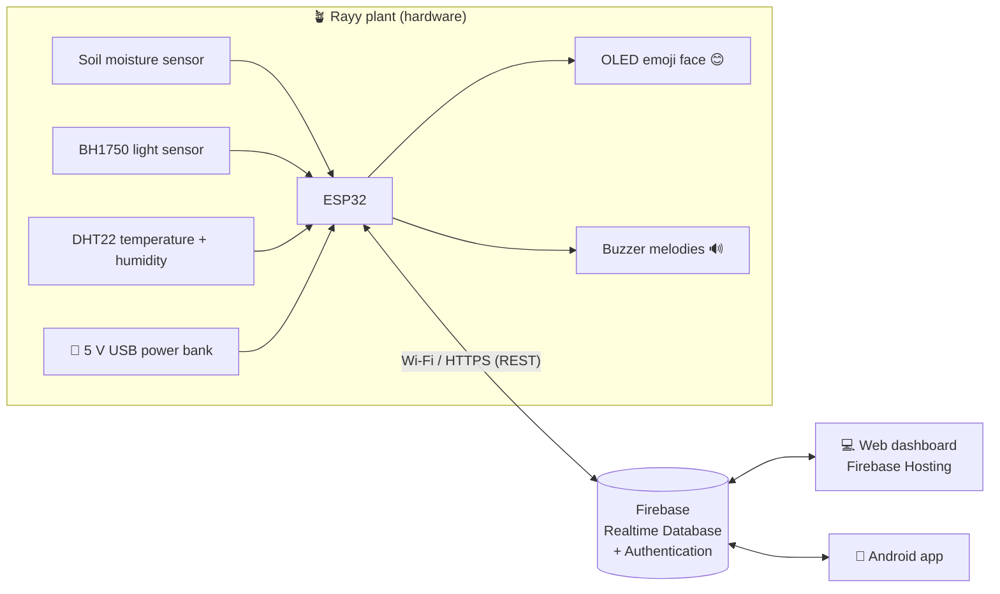

# 🌱 ري (Rayy): a smart IoT plant that shows its feelings

> **Graduation project.** **Rayy (ري, "watering / quenching thirst")** turns the plant's live readings
> (**soil moisture, light and temperature**) into **emoji faces** on a small screen and **sound alerts**
> (a different buzzer melody for each feeling).
> It sends its data to the cloud (**Firebase**), and a **web dashboard** and an **Android app** show it.
> Power comes from a simple **5 V USB power bank** (or phone charger).

| 😊 Happy | 😫 Thirsty | 🥴 Too wet | 🥵 Too hot | 🥶 Cold | 😞 Needs light | 😴 Sleeping |
|---|---|---|---|---|---|---|

---

## 1. Start here

👉 **[docs/00-step-by-step-guide.md](docs/00-step-by-step-guide.md)**: the complete guide from buying the parts
to the final demo, step by step.

📄 **[docs/Rayy-Documentation.docx](docs/Rayy-Documentation.docx)**: all the documentation in one Word file (for the report).

## 2. What is in this folder

| Folder / file | What it contains |
|---|---|
| [`docs/`](docs) | **Full project documentation** (chapters 00 → 10 + Word file + diagrams) |
| [`firmware/Rayy/`](firmware/Rayy) | ESP32 program (Arduino IDE): sensors, emoji faces, buzzer melodies, Firebase |
| [`web/`](web) | Web dashboard (HTML + CSS + JavaScript, Arabic / English) |
| [`android/Rayy/`](android/Rayy) | Android Studio project **Rayy** (Kotlin + Jetpack Compose, Arabic / English) |
| [`firebase/database.rules.json`](firebase/database.rules.json) | Security rules for the Realtime Database |
| [`firebase.json`](firebase.json) | Firebase Hosting + rules deploy configuration |
| [`tests/`](tests) | Unit tests of the plant "mood" logic (run on a PC) |

## 3. Documentation index

0. [Step-by-step guide (start here)](docs/00-step-by-step-guide.md)
1. [Requirements and system analysis](docs/01-requirements.md)
2. [Hardware components (bill of materials) and power](docs/02-hardware-bom.md)
3. [Wiring and assembly](docs/03-wiring.md)
4. [Database: why Firebase, and the step-by-step setup](docs/04-firebase-setup.md)
5. [ESP32 firmware: installation, how the code works, the melodies](docs/05-firmware.md)
6. [Web application](docs/06-web-app.md)
7. [Android application](docs/07-android-app.md)
8. [Calibration and testing](docs/08-testing-calibration.md)
9. [6-week project plan and team roles](docs/09-project-plan.md)
10. [Graduation report outline, presentation and future work](docs/10-report-outline.md)

## 4. System architecture

* The **ESP32** reads the sensors every 2 s, chooses a mood, draws the emoji and plays a melody.
  It works **without internet** too: the face and sounds keep working, and only the cloud upload stops.
* Every 30 s it uploads the **live** data. Every 5 min it saves a **history** point. Each time the mood
  changes it writes an **event**. It also downloads the **config** (thresholds, quiet hours, mute) set from the apps.
* The **web** and **Android** apps sign in with Firebase Authentication and update in real time.
  They can change the settings and press **"Play"** to make the plant play a melody.

## 5. Quick start (summary)

1. Buy the parts ([docs/02](docs/02-hardware-bom.md)) and wire them ([docs/03](docs/03-wiring.md)).
2. Create the Firebase project ([docs/04](docs/04-firebase-setup.md)).
3. Edit `firmware/Rayy/config.h` (Wi-Fi + Firebase) and upload it with the Arduino IDE ([docs/05](docs/05-firmware.md)).
4. Paste your Firebase web config into `web/firebase-config.js` and run `firebase deploy` ([docs/06](docs/06-web-app.md)).
5. Put `google-services.json` in `android/Rayy/app/`, open `android/Rayy/` in Android Studio and press ▶ ([docs/07](docs/07-android-app.md)).
6. Calibrate the soil sensor and run the tests ([docs/08](docs/08-testing-calibration.md)).

> 💡 **Try the web dashboard without any hardware:** run `python -m http.server 8000` inside `web/` and open
> <http://localhost:8000/?demo=1>. It shows simulated plant data.
