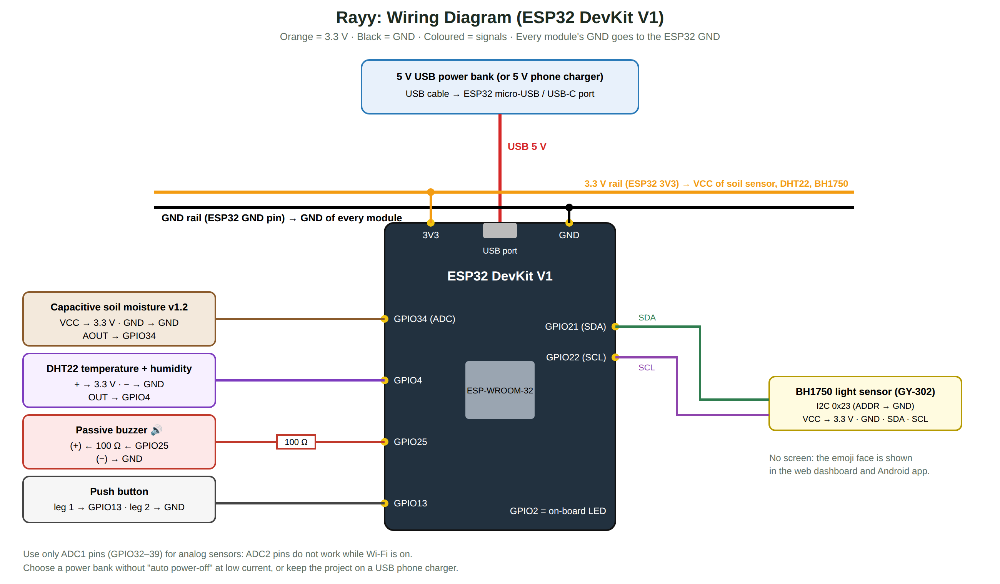

# 00 · Step-by-Step Guide: Build the Whole Project from Zero

Follow these steps **in order**. Each step says what to do, how long it takes, and how to check that it worked.
More detail for each step is in the other chapters (01–10).

| Step | What you build | Time |
|---|---|---|
| 1 | Buy the components | 1–3 days |
| 2 | Install the software on the computer | 1 hour |
| 3 | Create the Firebase project (database + login + hosting) | 30 min |
| 4 | Wire the hardware on a breadboard | 2 hours |
| 5 | Configure and upload the ESP32 code | 30 min |
| 6 | Calibrate the soil sensor | 15 min |
| 7 | Run and publish the web dashboard | 30 min |
| 8 | Build and install the Android app | 1 hour |
| 9 | Test everything | 2 hours |
| 10 | Final assembly on the pot, report, presentation | 1–2 weeks |

---

## Step 1: Buy the components

Full list with explanations and prices: [02-hardware-bom.md](02-hardware-bom.md). The main items are:

* ESP32 DevKit V1 + a USB data cable (micro-USB or USB-C, depending on the board)
* Capacitive soil moisture sensor v1.2
* DHT22 (temperature + humidity) module
* BH1750 (GY-302) light sensor module
* Passive buzzer (module or bare) + 100 Ω resistor
* Push button
* Breadboard + jumper wires (male-male and female-male)
* **5 V USB power bank** (or any 5 V USB phone charger)
* A small potted plant 🌿

✅ **Check:** you have every item in the list before you start step 4.

---

## Step 2: Install the software

On a Windows / macOS / Linux computer:

1. **Arduino IDE 2.x**: <https://www.arduino.cc/en/software>
2. **USB driver** for the ESP32 (only if the board is not detected): CP210x
   (<https://www.silabs.com/developers/usb-to-uart-bridge-vcp-drivers>) or CH340, depending on the chip near the USB port.
3. In Arduino IDE: **File → Preferences → Additional boards manager URLs**, paste
   `https://espressif.github.io/arduino-esp32/package_esp32_index.json`, then
   **Tools → Board → Boards Manager** → search **esp32** → install **"esp32 by Espressif Systems"** (3.x).
4. **Tools → Manage Libraries** → install:
   * **DHT sensor library** by Adafruit (click "Install all")
   * **BH1750** by Christopher Laws
   * **ArduinoJson** by Benoit Blanchon (version 7)
5. **Android Studio Panda (2025.3.1) or newer**: <https://developer.android.com/studio> (for the Android app; the project uses Gradle 9.1.0 + AGP 9.0.1 and runs on Java 17–25)
6. **Node.js LTS**: <https://nodejs.org>, then in a terminal: `npm install -g firebase-tools` (to publish the website)
7. **Python 3** (optional, to run the website on your computer) or the VS Code **Live Server** extension.

✅ **Check:** in Arduino IDE, **Tools → Board** shows "esp32 → ESP32 Dev Module".

---

## Step 3: Create the Firebase project

Detailed with screenshots-style instructions: [04-firebase-setup.md](04-firebase-setup.md). In short:

1. <https://console.firebase.google.com> → **Add project** → project name **`Rayy`**. Firebase makes a unique project ID from it (for example `rayy-1a2b3`); that is normal.
2. **Authentication → Get started → Email/Password → Enable**. In **Users**, add:
   * `device@rayy.app` + password (used by the ESP32)
   * `team@rayy.app` + password (used to log in to the web and Android apps)
3. **Realtime Database → Create database** → location Belgium (europe-west1) → **locked mode**.
   Copy the database URL. In the **Rules** tab, paste the content of `firebase/database.rules.json` → **Publish**.
4. **Project settings → Your apps → Web (`</>`)** → register → copy the `firebaseConfig` values.
5. **Project settings → Your apps → Android** → package name **`com.rayy.app`**, app nickname **`Rayy`** → download `google-services.json`.

✅ **Check:** the Realtime Database page shows your URL, and Authentication → Users shows 2 users.

---

## Step 4: Wire the hardware

**Unplug the USB cable while wiring.** Follow [03-wiring.md](03-wiring.md) and the diagram:



| Module | Pin → ESP32 |
|---|---|
| Soil sensor | VCC → 3V3 · GND → GND · AOUT → **GPIO34** |
| DHT22 | + → 3V3 · − → GND · OUT → **GPIO4** |
| BH1750 | VCC → 3V3 · GND → GND · SDA → **GPIO21** · SCL → **GPIO22** · ADDR → GND |
| Buzzer | (+) → **100 Ω** → **GPIO25** · (−) → GND |
| Button | one leg → **GPIO13** · other leg → GND |

Tip: on the breadboard, connect the ESP32 **3V3** pin to one "+" row and **GND** to one "−" row, then connect all
modules' VCC/GND to these rows.

✅ **Check:** look at every VCC and GND twice. A reversed VCC/GND can burn a module.

---

## Step 5: Configure and upload the ESP32 code

1. Open `firmware/Rayy/Rayy.ino` in Arduino IDE (all the other files open as tabs).
2. In the **`config.h`** tab, fill in:
   ```cpp
   #define WIFI_SSID            "YourWiFi"          // 2.4 GHz network or phone hotspot
   #define WIFI_PASSWORD        "YourPassword"
   #define FIREBASE_API_KEY     "AIza..."           // apiKey from step 3.4
   #define FIREBASE_DB_URL      "https://rayy-xxxx-default-rtdb.europe-west1.firebasedatabase.app"
   #define FIREBASE_USER_EMAIL  "device@rayy.app"
   #define FIREBASE_USER_PASS   "the device password"
   ```
3. Connect the ESP32 with the USB cable. Select **Tools → Board → ESP32 Dev Module** and **Tools → Port** (COM…).
4. Click **Upload (→)**. If it says "Connecting…" for a long time, **hold the BOOT button** on the board.
5. Open **Tools → Serial Monitor** at **115200 baud**.

✅ **Check:**
* You hear the "hello" melody.
* The Serial Monitor shows `[cloud] signed in to Firebase` and a line of readings every 2 seconds.
* In the Firebase console → Realtime Database, `plants/plant01/live` appears and updates every 30 s.

---

## Step 6: Calibrate the soil sensor

1. Keep the Serial Monitor open. Hold the soil sensor **in the air**: note the `raw` value (e.g. 3050).
2. Put the sensor **in a glass of water** (up to the white line): note the `raw` value (e.g. 1280).
3. Put these numbers in `config.h`: `SOIL_RAW_DRY 3050`, `SOIL_RAW_WET 1280`, then upload again.

✅ **Check:** dry soil shows about 10–25 %, and freshly watered soil about 60–80 %.

---

## Step 7: Web dashboard

1. Open `web/firebase-config.js` and paste your `firebaseConfig` values from step 3.4.
2. Try it on your computer:
   ```bash
   cd web
   python -m http.server 8000
   ```
   Open <http://localhost:8000> and log in with `team@rayy.app`.
   (Before configuring Firebase, <http://localhost:8000/?demo=1> shows fake data.)
3. Publish it on the internet:
   ```bash
   cd rayy
   firebase login
   firebase use --add            # choose your project
   firebase deploy --only hosting,database
   ```
   Your dashboard is now at `https://<project-id>.web.app`.

✅ **Check:** the website shows the plant's emoji (e.g. 😫 when the soil sensor is in dry air), and the badge says "Online".

---

## Step 8: Android app

0. Unzip the project into a folder whose path has **English letters only**, for example `E:\Rayy-Project`
   (not `E:\Ray ري\...`). Android Studio refuses to build in folders with Arabic letters in the path.
1. Copy `google-services.json` (step 3.5) into **`android/Rayy/app/`**.
2. Android Studio → **File → Open** → choose the **`android/Rayy`** folder (the project name shows as **Rayy**) → wait for "Gradle sync" to finish (the first time it downloads Gradle 9.1.0).
3. Connect your phone (enable **Developer options → USB debugging**) or create an emulator → press **▶ Run**.
4. To get an installable file: **Build → Build App Bundle(s) / APK(s) → Build APK(s)**. The file is at
   `android/Rayy/app/build/outputs/apk/debug/app-debug.apk`.

✅ **Check:** after login, the app shows the live emoji and values. "Play" makes the buzzer play.

---

## Step 9: Test everything

Use the test table in [08-testing-calibration.md](08-testing-calibration.md). The most important tests:

1. Take the soil sensor out of the soil → 😫 face + "thirsty" melody + apps show "Thirsty".
2. Put it back into wet soil → 😊 face + "thank you" melody.
3. Cover the light sensor during the day → 😞 "needs light".
4. Turn off the Wi-Fi → the face and sounds still work; the apps show "Offline".

---

## Step 10: Final assembly, report and presentation

1. Move the circuit from the breadboard to a small **perfboard** (solder) or keep a mini breadboard inside a box.
2. Put it in a small **box** with holes for the buzzer and the USB cable. Fix the box to
   the pot. Keep the DHT22 and BH1750 **outside** the box.
3. Power it with the **power bank** (it lasts about 2–3 days with 10,000 mAh; recharge it like a phone) or with a
   USB phone charger permanently.
4. Write the report using [10-report-outline.md](10-report-outline.md), and follow the plan in [09-project-plan.md](09-project-plan.md).
