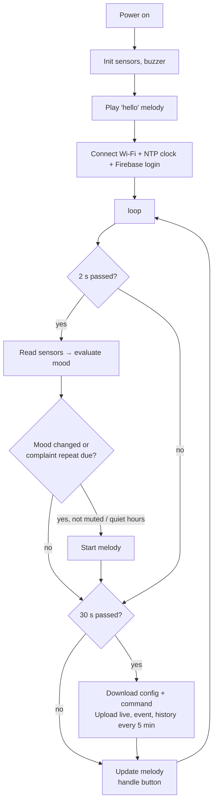

# 05 · ESP32 Firmware

Code: [`firmware/Rayy/`](../firmware/Rayy). It was compiled successfully for **ESP32 Dev Module** with
esp32 core 3.0.7 (≈ 84 % flash, 14 % RAM, no warnings).

## 5.1 Install the tools

1. Install **Arduino IDE 2.x**: <https://www.arduino.cc/en/software>.
2. USB driver if the board is not detected: **CP210x** (Silicon Labs) or **CH340**, depending on the chip near the USB port.
3. **File → Preferences → Additional boards manager URLs**, paste:
   `https://espressif.github.io/arduino-esp32/package_esp32_index.json`
4. **Tools → Board → Boards Manager** → search **esp32** → install **"esp32 by Espressif Systems"** (version **3.x**).
5. **Tools → Manage Libraries** → install:

| Library (search name) | Author |
|---|---|
| DHT sensor library | Adafruit (accept "install all": Adafruit Unified Sensor) |
| BH1750 | Christopher Laws |
| ArduinoJson | Benoit Blanchon (version **7.x**) |

> The code uses the esp32 core **3.x** buzzer functions (`ledcAttach`, `ledcWriteTone`). With the old core 2.x the
> compile fails, so update the core in the Boards Manager.

## 5.2 Configure and upload

1. Open `firmware/Rayy/Rayy.ino` (the other files open as tabs).
2. Edit **`config.h`**: Wi-Fi name/password, `FIREBASE_API_KEY`, `FIREBASE_DB_URL` (no `/` at the end), the device
   user email/password, and `PLANT_ID`.
3. **Tools → Board → esp32 → ESP32 Dev Module**, **Port** = the COM port of the board.
4. Click **Upload (→)**. If you see `Failed to connect… Timed out waiting for packet header`, **hold the BOOT
   button** on the ESP32 until "Connecting…" turns into "Writing…".
5. **Tools → Serial Monitor** at **115200 baud** shows:
```
=== Rayy (ري) smart plant ===
[sound] melody 9
[wifi] 192.168.1.23
[cloud] signed in to Firebase
soil=46% (raw 2190)  temp=27.4C  hum=38%  lux=5400  mood=happy  wifi=1 cloud=1
[mood] happy -> thirsty
[sound] melody 1
```
Note: the ESP32 supports **2.4 GHz Wi-Fi only**. A phone hotspot works well for demos.

After uploading, unplug the USB cable from the computer and plug the ESP32 into the **power bank**. The program
starts by itself.

## 5.3 Code structure

| File | Responsibility |
|---|---|
| `Rayy.ino` | Main program: `setup()`, `loop()`, timing, button |
| `config.h` | **All settings** (Wi-Fi, Firebase, intervals, soil calibration, time zone) |
| `pins.h` | Pin map |
| `mood.h / mood.cpp` | The plant "brain": readings → mood, and which melody to play (pure C++, unit-tested) |
| `sensors.h / .cpp` | Soil (ADC + calibration), DHT22, BH1750 |
| `status.h` | The current plant state (readings, mood, Wi-Fi/cloud, mute) shared with the cloud upload |
| `sound.h / .cpp` | Buzzer: 9 melodies played **in the background** (non-blocking), so the face keeps moving |
| `cloud.h / .cpp` | Wi-Fi reconnect, NTP clock (Riyadh time), Firebase login (REST), upload live/history/events, read config/command |

## 5.4 Program flow



## 5.5 The sound alerts (buzzer melodies)

A **passive buzzer** plays a note when the ESP32 sends it a square wave with the note's frequency (PWM).
`sound.cpp` contains each melody as a list of *(frequency, duration)* notes, for example the "thank you" melody:
`G5 120 ms, C6 120 ms, E6 120 ms, G6 200 ms, …`. The `soundLoop()` function moves to the next note when the time of the
current note is over, so the melody plays **without stopping** the face animation or the sensors.

| # | Melody | When |
|---|---|---|
| 1 | Sad "help!" (played twice) | Thirsty 😫 |
| 2 | Fast bubbling notes | Too wet 🥴 |
| 3 | Alarm beeps | Hot 🥵 |
| 4 | Shivering trill | Cold 🥶 |
| 5 | Rising notes then a low note ("where is the sun?") | Needs light 😞 |
| 6 | Happy arpeggio | Becomes happy 😊 |
| 7 | Joyful "thank you" | Happy **after watering** |
| 8 | Slow lullaby | Night starts 😴 |
| 9 | Short "hello" | Power on |

You can compose your own melodies by changing the notes in `sound.cpp`.

## 5.6 How the cloud connection works (REST API)

The firmware uses **plain HTTPS requests** (`HTTPClient` + `ArduinoJson`) instead of a big Firebase library.
This makes the code small and easy to explain:

1. **Login:** `POST https://identitytoolkit.googleapis.com/v1/accounts:signInWithPassword?key=API_KEY` with
   the email/password. The answer contains an **idToken** valid for 1 hour (the firmware renews it after 50 min).
2. **Write live:** `PUT {DB_URL}/plants/plant01/live.json?auth=idToken` with a JSON body.
   `"ts": {".sv": "timestamp"}` asks Firebase to insert the **server time**.
3. **Add history / event:** `POST …/history.json` creates a new child with a unique, time-ordered key.
4. **Read settings:** `GET …/config.json`. **Read a command:** `GET …/command.json`, then `DELETE` it.

## 5.7 The emoji faces (in the apps, not on the plant)

The project has **no screen**. The ESP32 sends the mood name (`happy`, `thirsty`, …) to Firebase and the **web dashboard**
and **Android app** show the matching emoji: 😊 happy · 😫 thirsty · 🥴 too wet · 🥵 hot · 🥶 cold · 😞 needs light · 😴 sleeping.
On the plant itself, the mood is expressed by the **melody** of the buzzer. A press on the push button plays the current mood's melody.

## 5.8 Changing behaviour

* **Thresholds, quiet hours, mute:** from the web app (no re-upload needed). The ESP32 reads them every 30 s.
* **Intervals, soil calibration:** `config.h`.
* **Add a new mood:** add it to `enum Mood`, `evaluateMood()`, `moodName()`, a melody in
  `sound.cpp`, and the texts in the apps.

## 5.9 Unit tests of the mood logic (on a PC)

```bash
cd tests
g++ -std=c++17 -I../firmware/Rayy test_mood.cpp ../firmware/Rayy/mood.cpp -o test_mood
./test_mood          # → "33 checks, 0 failures"
```
