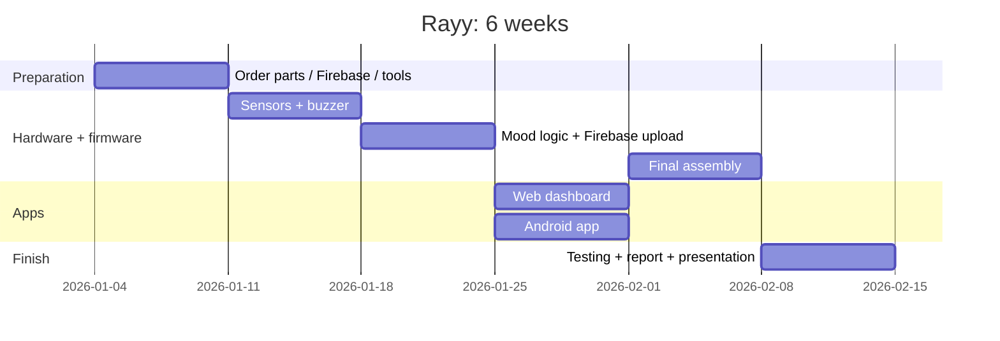

# 09 · 6-Week Project Plan and Team Roles

## 9.1 Team roles (6 members)

| Role | Main responsibility |
|---|---|
| **Team leader + integration** | Planning, meetings, purchasing, final integration, presentation |
| **Hardware & wiring** | Sensors, buzzer, button, breadboard → final board, enclosure |
| **Firmware (ESP32)** | Arduino code, calibration, mood logic, melodies |
| **Firebase + web** | Firebase project, rules, web dashboard, hosting |
| **Android** | Android app, building and testing the APK |
| **Documentation + testing** | Test plan, screenshots, report writing, demo video |

Everyone tests the system and writes their own part of the report.

## 9.2 Weekly plan

| Week | Goals | Deliverables |
|---|---|---|
| **1** | Approve the proposal. Study the docs. **Order the components**. Create the Firebase project and accounts. Install Arduino IDE + Android Studio | Components bought, Firebase ready |
| **2** | Breadboard: ESP32 + buzzer (melodies), then BH1750, DHT22 and the soil sensor. Calibrate the soil sensor | Melodies and readings working |
| **3** | Mood logic, Wi-Fi + Firebase upload, button. Test with the Firebase console | Data visible in Firebase |
| **4** | Web dashboard (publish on Firebase Hosting). Android app (build the APK) | Web + Android with live data |
| **5** | Final assembly in a box on the pot. 2-day test on the power bank. Fix bugs | Finished prototype |
| **6** | Run the full test plan ([08](08-testing-calibration.md)), write the report, slides, demo video, rehearse | Final report, presentation, demo |

(Change the dates to your semester.)

## 9.3 Risks and mitigation

| Risk | Mitigation |
|---|---|
| Components arrive late | Order in week 1 from a local shop. Buy a spare sensor |
| Burned module (wrong polarity) | Check VCC/GND twice before plugging in the USB cable |
| College Wi-Fi blocks devices / needs a login page | Use a **phone hotspot** (2.4 GHz) for the demo |
| Power bank turns off by itself | Use one with an "always-on" mode or a USB phone charger |
| Android build problems | Use the web dashboard (it also works on phones) as a backup, and build the APK early (week 4) |
| Firebase settings wrong | Test with the `curl` commands in [04](04-firebase-setup.md) and the web demo mode |
