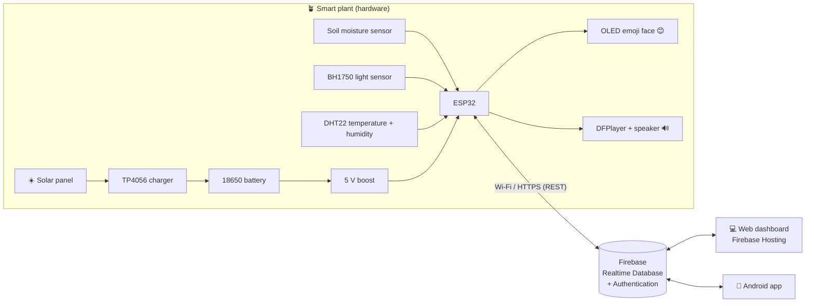

# 🌱 Smart Emoji Plant: a solar-powered IoT plant that shows its feelings

> **Graduation project.** The plant turns its live readings (soil moisture, light and temperature) into
> **emoji faces** on a small screen and **voice messages** from a speaker.
> It sends its data to the cloud, where a **web dashboard** and an **Android app** show it.
> It runs on **solar energy**.

| 😊 Happy | 😫 Thirsty | 🥴 Too wet | 🥵 Too hot | 🥶 Cold | 😞 Needs light | 😴 Sleeping |
|---|---|---|---|---|---|---|

---

## 1. What is in this folder

| Folder / file | What it contains |
|---|---|
| [`docs/`](docs) | **Full project documentation** (read it in order 01 → 10) |
| [`firmware/SmartPlant/`](firmware/SmartPlant) | ESP32 program (Arduino IDE): sensors, emoji faces, voice, Firebase |
| [`web/`](web) | Web dashboard (HTML + CSS + JavaScript, Arabic / English) |
| [`android/`](android) | Android application (Kotlin + Jetpack Compose, Arabic / English) |
| [`firebase/database.rules.json`](firebase/database.rules.json) | Security rules for the Realtime Database |
| [`firebase.json`](firebase.json) | Firebase Hosting + rules deploy configuration |
| [`sound/`](sound) | The voice messages to record and copy to the micro-SD card |
| [`tests/`](tests) | Unit tests of the plant "mood" logic (run on a PC) |

## 2. Documentation index

1. [Requirements and system analysis](docs/01-requirements.md)
2. [Hardware components (bill of materials) and power budget](docs/02-hardware-bom.md)
3. [Wiring and assembly](docs/03-wiring.md)
4. [Database: why Firebase, and the step-by-step setup](docs/04-firebase-setup.md)
5. [ESP32 firmware: installation and how the code works](docs/05-firmware.md)
6. [Web application](docs/06-web-app.md)
7. [Android application](docs/07-android-app.md)
8. [Calibration and testing](docs/08-testing-calibration.md)
9. [6-week project plan and team roles](docs/09-project-plan.md)
10. [Graduation report outline, presentation and future work](docs/10-report-outline.md)

## 3. System architecture

* The **ESP32** reads the sensors every 2 s, chooses a mood, draws the emoji and plays a voice message.
  It works **without internet** too: the face and voice keep working, and only the cloud upload stops.
* Every 30 s it uploads the **live** data. Every 5 min it saves a **history** point. Each time the mood
  changes it writes an **event**. It also downloads the **config** (thresholds, mute, volume) set from the apps.
* The **web** and **Android** apps sign in with Firebase Authentication and update in real time.
  They can change the settings and press **"Speak now"**, and the plant talks.

## 4. Quick start (summary)

1. Buy the parts in [docs/02](docs/02-hardware-bom.md) and wire them as in [docs/03](docs/03-wiring.md).
2. Create the Firebase project as in [docs/04](docs/04-firebase-setup.md).
3. Edit `firmware/SmartPlant/config.h` (Wi-Fi + Firebase) and upload it with the Arduino IDE ([docs/05](docs/05-firmware.md)).
4. Paste your Firebase web config into `web/firebase-config.js` and deploy it with `firebase deploy` ([docs/06](docs/06-web-app.md)).
5. Put `google-services.json` in `android/app/`, open `android/` in Android Studio and press ▶ ([docs/07](docs/07-android-app.md)).
6. Record the voice files ([sound/](sound)), copy them to the micro-SD card, and calibrate the soil sensor ([docs/08](docs/08-testing-calibration.md)).

> 💡 **Try the web dashboard without any hardware:** open `web/index.html?demo=1` through a local web
> server (see docs/06). It shows simulated plant data.
