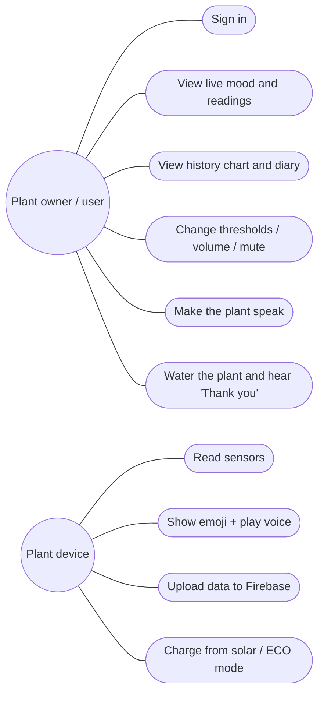
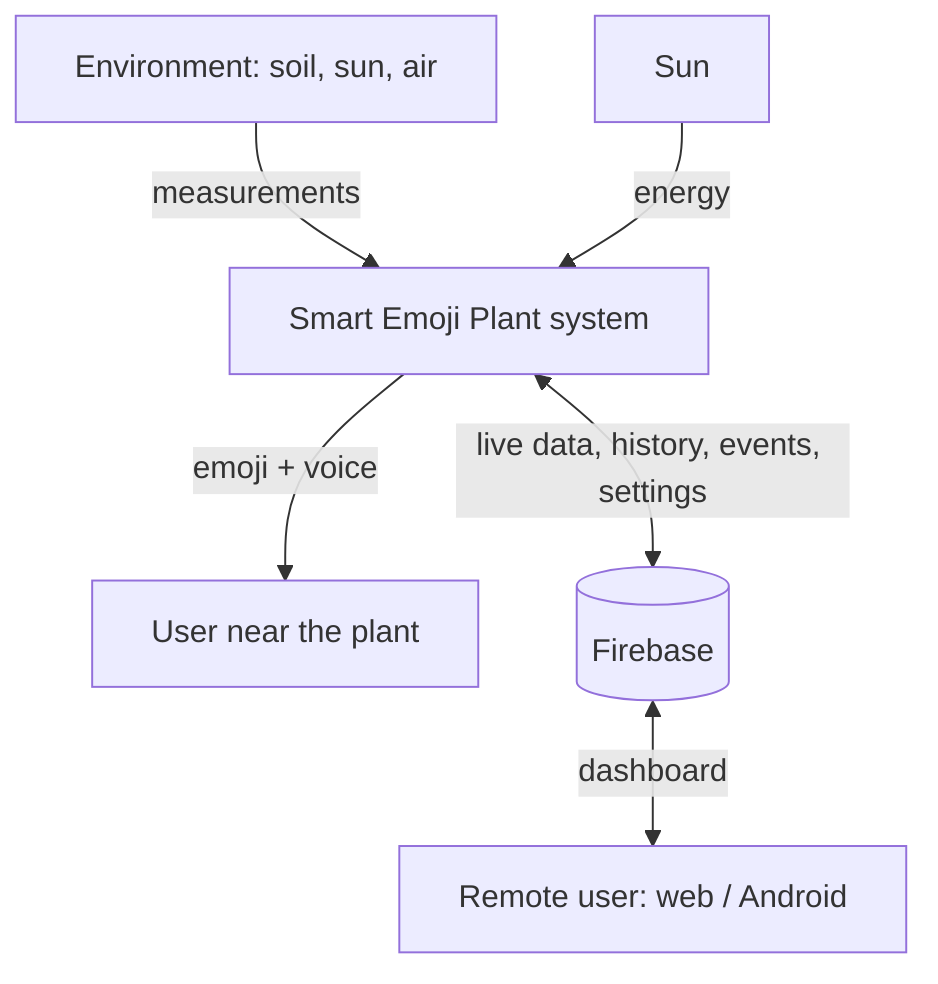

# 01 · Requirements and System Analysis

## 1.1 Project idea (from the proposal)

An interactive plant that **expresses its feelings with emoji and sound**. It runs on **solar power** and uses
**Internet of Things (IoT)** technology. The plant's live readings (**soil moisture, light and
temperature**) become digital **facial expressions (emoji)** and **voice alerts**. A sustainable solar energy
system powers it.

**Importance**

* **Keeps plants alive:** it watches watering and soil moisture so the plant never reaches drought or death.
* **Environmental awareness and smart interaction:** a fun, innovative way to "talk" with plants through IoT,
  emoji and voice alerts.
* **Sustainability:** it runs entirely on solar energy, so it is eco-friendly and saves energy.

**Duration:** 6 weeks. **Team:** 6 members.

## 1.2 Objectives

1. Measure soil moisture, light intensity, air temperature and humidity automatically.
2. Show the plant's state as an **animated emoji face** on a display next to the plant.
3. Play **voice messages** ("I'm thirsty!", "Thank you!", …) when the plant needs something.
4. Send the data to the **cloud** (Firebase) and show it on a **web dashboard** and an **Android app**.
5. Power the whole system with a **solar panel + rechargeable battery**.
6. Let the user change the plant thresholds, mute the voice, and make the plant speak from the apps.

## 1.3 Why the ESP32 (and not the ESP8266)

| Need of this project | ESP32 | ESP8266 |
|---|---|---|
| Analog inputs (soil sensor, battery voltage, solar voltage = **3 analog signals**) | ✅ 18 ADC channels | ❌ only **1** ADC pin |
| Hardware serial port for the DFPlayer (voice) | ✅ 3 UARTs | ⚠️ 1 UART (used by USB) |
| HTTPS (Firebase) memory | ✅ 520 KB RAM | ⚠️ 80 KB, often unstable with TLS |
| Deep sleep to save battery | ✅ | ✅ |
| Price | ~ same | ~ same |

➡️ **Use the ESP32 DevKit V1 (ESP-WROOM-32).** The ESP8266 would need an extra ADC chip and software serial.

## 1.4 Functional requirements

| ID | Requirement |
|---|---|
| FR-1 | The system shall read soil moisture (%) every 2 seconds. |
| FR-2 | The system shall read light intensity (lux), air temperature (°C) and humidity (%). |
| FR-3 | The system shall decide the plant mood: *happy, thirsty, drowning (too wet), hot, cold, needs light, sleeping*. |
| FR-4 | The system shall display an animated emoji face for the mood on the OLED screen, and a data screen. |
| FR-5 | The system shall play a voice message when the mood changes, and repeat a complaint every 30 min (configurable). |
| FR-6 | The system shall stay silent during quiet hours (default 22:00–07:00) and when muted. |
| FR-7 | The system shall upload the live readings to Firebase every 30 s, a history point every 5 min, and an event on each mood change. |
| FR-8 | The system shall measure the battery and solar panel voltage and report the battery % and charging state. |
| FR-9 | The system shall enter ECO mode (deep sleep 15 min between readings) when the battery is low. |
| FR-10 | The web and Android apps shall require a login (email + password). |
| FR-11 | The apps shall show the emoji mood, all live values, online/offline status, last-update time. |
| FR-12 | The apps shall show a 24-hour history chart and the "plant diary" (list of mood changes). |
| FR-13 | The apps shall let the user make the plant speak a chosen message ("Speak now") and mute it. |
| FR-14 | The web app shall let the user edit thresholds (moisture, temperature, light), quiet hours and volume. |
| FR-15 | The apps shall support Arabic and English. |
| FR-16 | A push button on the plant: short press = change screen, long press = speak the current mood. |

## 1.5 Non-functional requirements

| ID | Requirement |
|---|---|
| NFR-1 | **Availability:** the face and voice must work even without Wi-Fi/internet (local decision on the ESP32). |
| NFR-2 | **Energy:** the device must run day and night on solar power (≥ 1 day of battery autonomy). |
| NFR-3 | **Security:** only signed-in users can read or write the database (Firebase rules). Passwords are never stored in the apps. |
| NFR-4 | **Performance:** live data appears in the apps less than 35 s after a change. |
| NFR-5 | **Usability:** the apps are simple, bilingual, and work on phones (responsive design). |
| NFR-6 | **Cost:** total hardware cost around 250–450 SAR. |
| NFR-7 | **Maintainability:** clear modular code, configuration in one file (`config.h`). |
| NFR-8 | **Safety:** protected Li-ion charger, fuse-free low voltage (≤ 7 V), battery kept out of direct sun. |

## 1.6 Hardware requirements (summary; details in [02](02-hardware-bom.md))

ESP32 DevKit V1 · capacitive soil moisture sensor v1.2 · BH1750 light sensor · DHT22 temperature/humidity
sensor · 0.96" OLED SSD1306 (I2C) · DFPlayer Mini + micro-SD + 3 W speaker · push button ·
6 V 5–6 W solar panel · TP4056 charger (with protection) · 2 × 18650 Li-ion + holder · MT3608 5 V boost ·
switch · 1N5819 diode · resistors (100 kΩ ×3, 47 kΩ, 1 kΩ) · 100 nF capacitor · wires, breadboard/PCB, enclosure.

## 1.7 Software requirements

| Part | Tool / technology |
|---|---|
| Firmware | Arduino IDE 2.x + "esp32 by Espressif" core 3.x, C++ |
| Arduino libraries | Adafruit SSD1306, Adafruit GFX, DHT sensor library, Adafruit Unified Sensor, BH1750 (Christopher Laws), DFRobotDFPlayerMini, ArduinoJson 7 |
| Cloud / database | **Firebase**: Realtime Database, Authentication (email/password), Hosting |
| Web app | HTML5, CSS3, JavaScript (ES modules), Firebase JS SDK 10, Chart.js 4 |
| Android app | Android Studio (Koala or newer), Kotlin, Jetpack Compose (Material 3), Firebase Android SDK (BoM 33) |
| Tools | Node.js + `firebase-tools` (deploy), Audacity (voice recording), Git |

## 1.8 Users and use cases

## 1.9 Mood rules (the "brain" of the plant)

Rules are checked **in this order** (the first that matches wins). Thresholds can be changed from the web app.

| Priority | Condition (defaults) | Mood | Face | Voice track |
|---|---|---|---|---|
| 1 | soil moisture < 30 % | Thirsty | 😫 | 0001 |
| 2 | soil moisture > 85 % | Too wet (drowning) | 🥴 | 0002 |
| 3 | temperature > 35 °C | Hot | 🥵 | 0003 |
| 4 | temperature < 10 °C | Cold | 🥶 | 0004 |
| 5 | night (18:00–06:00) | Sleeping | 😴 | 0008 (once) |
| 6 | day and light < 200 lux | Needs light | 😞 | 0005 |
| 7 | otherwise | Happy | 😊 | 0006 / 0007 "Thank you" after watering |

* **Hysteresis:** a problem is "solved" only when the value is better by a margin (5 % moisture, 1 °C, 50 lux).
  This stops the face from flickering around a threshold.
* **Voice:** the plant plays a voice message when the mood changes. A complaint repeats every 30 min. The plant is silent during quiet hours or when muted.

## 1.10 Context diagram

