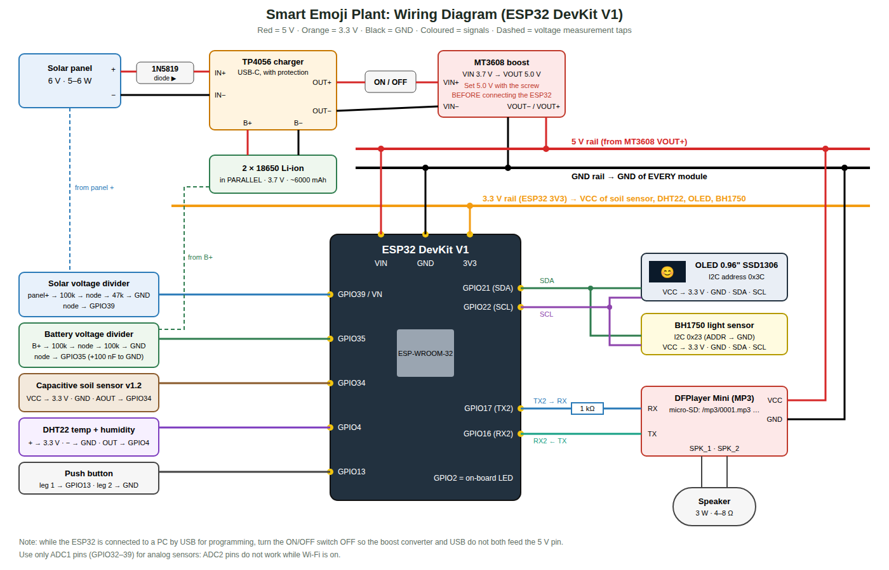

# 03 · Wiring and Assembly

(Vector version: [`images/wiring-diagram.svg`](images/wiring-diagram.svg))

## 3.1 ESP32 pin map

| ESP32 pin | Connected to | Notes |
|---|---|---|
| **VIN** | 5 V rail (MT3608 VOUT+) | The board's own regulator makes 3.3 V |
| **GND** | GND rail | **All grounds together** |
| **3V3** | 3.3 V rail | Feeds the sensors and OLED (total < 100 mA) |
| **GPIO34** | Soil sensor **AOUT** | Input-only ADC1 pin |
| **GPIO35** | Battery divider middle point | Input-only ADC1 pin |
| **GPIO39 (VN)** | Solar divider middle point | Input-only ADC1 pin |
| **GPIO4** | DHT22 **DATA/OUT** | |
| **GPIO21** | I2C **SDA**: OLED + BH1750 | Shared bus |
| **GPIO22** | I2C **SCL**: OLED + BH1750 | Shared bus |
| **GPIO17 (TX2)** | **1 kΩ** resistor → DFPlayer **RX** | The resistor removes noise / buzzing |
| **GPIO16 (RX2)** | DFPlayer **TX** | |
| **GPIO13** | Push button → GND | Internal pull-up is used |
| GPIO2 | On-board blue LED | Solid = connected to Firebase, blinking = offline |

> Analog sensors **must** use ADC1 pins (GPIO32–39). ADC2 pins stop working when Wi-Fi is on.

## 3.2 Module by module

### Capacitive soil moisture sensor v1.2
| Sensor pin | Connect to |
|---|---|
| VCC | 3.3 V |
| GND | GND |
| AOUT | GPIO34 |

Push the sensor into the soil **up to the white line only**. The electronics at the top must stay dry.
To make it waterproof, cover the top edge and the electronics with nail polish, hot glue or heat-shrink.

### DHT22 (module with 3 pins)
| Sensor pin | Connect to |
|---|---|
| + (VCC) | 3.3 V |
| OUT (DATA) | GPIO4 |
| − (GND) | GND |

If you have the **bare 4-pin** DHT22: pin 1 = VCC, pin 2 = DATA (add a **10 kΩ** resistor DATA → 3.3 V), pin 3 = not
connected, pin 4 = GND. Place it in the shade, not inside the closed box (the electronics heat the box).

### BH1750 light sensor (GY-302)
| Sensor pin | Connect to |
|---|---|
| VCC | 3.3 V |
| GND | GND |
| SCL | GPIO22 |
| SDA | GPIO21 |
| ADDR | GND (address 0x23) |

Point it **up**, next to the plant leaves, and keep it out of the shadow of the box.

### OLED 0.96" SSD1306 I2C
| OLED pin | Connect to |
|---|---|
| VCC | 3.3 V |
| GND | GND |
| SCL | GPIO22 |
| SDA | GPIO21 |

Some OLEDs have the pins in the order **GND-VCC-SCL-SDA** and others **VCC-GND-SCL-SDA**. Read the labels!
If the I2C address is **0x3D** instead of 0x3C (rare), change it in `display.cpp`.

### DFPlayer Mini + speaker
| DFPlayer pin | Connect to |
|---|---|
| VCC | **5 V** rail (with a 470–1000 µF capacitor between VCC and GND close to the module) |
| GND (either GND pin) | GND |
| RX | **1 kΩ** resistor → GPIO17 |
| TX | GPIO16 |
| SPK_1 and SPK_2 | the two speaker wires |

Do **not** connect a speaker pin to GND. The amplifier output is bridged.

### Push button
One leg → GPIO13, the other leg → GND.

## 3.3 Power section (solar → battery → 5 V)

1. **Solar panel +** → **1N5819 diode** (stripe side towards the TP4056) → **TP4056 IN+**.
   **Solar panel −** → **TP4056 IN−**.
2. **TP4056 B+ / B−** → battery holder **+ / −** (2 × 18650 in **parallel**).
3. **TP4056 OUT+** → **switch** → **MT3608 VIN+**. **TP4056 OUT−** → **MT3608 VIN−**.
4. **Before** connecting anything to the MT3608 output, turn the switch on, measure VOUT with a multimeter and
   turn the small brass screw until it reads **5.0 V** (counter-clockwise usually lowers the voltage).
5. **MT3608 VOUT+** → **5 V rail** (ESP32 VIN + DFPlayer VCC). **MT3608 VOUT−** → **GND rail**.

### Voltage measurement dividers
* **Battery:** B+ → 100 kΩ → *middle point* → 100 kΩ → GND. Middle point → **GPIO35**, plus a 100 nF capacitor from
  the middle point to GND. A full battery (4.2 V) gives 2.1 V at the pin.
* **Solar:** panel + (before the diode) → 100 kΩ → *middle point* → 47 kΩ → GND. Middle point → **GPIO39**.
  A 7.2 V open-circuit panel gives 2.3 V at the pin (safe; the maximum is 3.3 V).

> ⚠️ **Programming:** turn the power switch **OFF** when the ESP32 is plugged into the computer. Otherwise
> USB 5 V and the boost converter both feed the same pin.
> During development you can power everything from USB only. The firmware detects "no battery" (< 2.5 V on GPIO35)
> and shows 100 %.

## 3.4 Assembly steps (recommended order)

1. **Breadboard test (week 2):** connect the ESP32 + OLED only, then upload the firmware with the battery parts not connected.
   Check that the face appears.
2. Add the **BH1750 and DHT22** and check the readings in the Serial Monitor (115200 baud).
3. Add the **soil sensor** and calibrate it ([08](08-testing-calibration.md)).
4. Add the **DFPlayer + speaker + SD card** and check that the "hello" voice plays at start.
5. Build the **power chain** separately. Set the MT3608 to 5.0 V, then connect it to the ESP32 VIN.
6. Move everything to a **perfboard / soldered PCB** with header pins, so modules can be replaced.
7. **Enclosure:** OLED behind a window at the front, speaker grill holes, the button on the side, cable glands for the
   soil sensor and solar cable, and ventilation holes. Mount the solar panel at about **25° tilt facing south**
   (best average angle for Riyadh).

## 3.5 Typical problems

| Problem | Cause / solution |
|---|---|
| OLED stays black | SDA/SCL swapped, VCC/GND swapped, or address 0x3D |
| BH1750 not found | Check SDA/SCL. Run an "I2C scanner" sketch: you should see 0x23 and 0x3C |
| DHT22 reads `nan` | Wrong pin, missing pull-up (bare sensor), or reading faster than every 2 s |
| Soil % always 0 or 100 | Not calibrated (see [08](08-testing-calibration.md)), or the sensor is on a non-ADC1 pin |
| DFPlayer silent | SD card not FAT32, files not in the `/mp3` folder, not named `0001.mp3`, TX/RX swapped |
| Buzzing sound | Missing 1 kΩ resistor or missing capacitor on DFPlayer VCC; use short wires |
| ESP32 resets when playing sound | 5 V supply too weak: check the MT3608 and the battery, and add the 1000 µF capacitor |
| Battery % wrong | Calibrate `BATTERY_CAL` in `config.h` with a multimeter |
