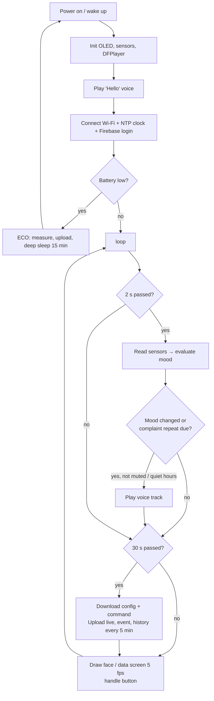

# 05 · ESP32 Firmware

Code: [`firmware/SmartPlant/`](../firmware/SmartPlant). It was compiled successfully for **ESP32 Dev Module** with
esp32 core 3.0.7 (≈ 85 % flash, 15 % RAM).

## 5.1 Install the tools

1. Install **Arduino IDE 2.x**: <https://www.arduino.cc/en/software>.
2. USB driver if the board is not detected: **CP210x** (Silicon Labs) or **CH340**, depending on the chip near the USB port.
3. **File → Preferences → Additional boards manager URLs**, paste:
   `https://espressif.github.io/arduino-esp32/package_esp32_index.json`
4. **Tools → Board → Boards Manager** → search **esp32** → install **"esp32 by Espressif Systems"** (version 3.x).
5. **Tools → Manage Libraries** → install:

| Library (search name) | Author |
|---|---|
| Adafruit SSD1306 | Adafruit (accept "install all" dependencies → Adafruit GFX, BusIO) |
| DHT sensor library | Adafruit (also installs Adafruit Unified Sensor) |
| BH1750 | Christopher Laws |
| DFRobotDFPlayerMini | DFRobot |
| ArduinoJson | Benoit Blanchon (version **7.x**) |

## 5.2 Configure and upload

1. Open `firmware/SmartPlant/SmartPlant.ino` (the other files open as tabs).
2. Edit **`config.h`**: Wi-Fi name/password, `FIREBASE_API_KEY`, `FIREBASE_DB_URL` (no `/` at the end), the device
   user email/password, and `PLANT_ID`.
3. **Tools → Board → esp32 → ESP32 Dev Module**, **Port** = the COM port of the board.
4. Click **Upload (→)**. If you see `Failed to connect… Timed out waiting for packet header`, **hold the BOOT
   button** on the ESP32 until "Connecting…" turns into "Writing…".
5. **Tools → Serial Monitor** at **115200 baud** shows:
```
=== Smart Emoji Plant ===
[wifi] 192.168.1.23
[cloud] signed in to Firebase
soil=46% (raw 2190)  temp=27.4C  hum=38%  lux=5400  batt=4.02V 87%  mood=happy  wifi=1 cloud=1
[mood] happy -> thirsty
[voice] playing /mp3/0001.mp3
```
Note: the ESP32 supports **2.4 GHz Wi-Fi only**. A phone hotspot works well for demos.

## 5.3 Code structure

| File | Responsibility |
|---|---|
| `SmartPlant.ino` | Main program: `setup()`, `loop()`, timing, button, ECO mode |
| `config.h` | **All settings** (Wi-Fi, Firebase, intervals, calibration) |
| `pins.h` | Pin map |
| `mood.h / mood.cpp` | The plant "brain": readings → mood, and which voice to play (pure C++, unit-tested) |
| `sensors.h / .cpp` | Soil (ADC + calibration), DHT22, BH1750, battery and solar voltage, battery % |
| `display.h / .cpp` | OLED: 7 animated emoji faces, status bar (moisture, temp, Wi-Fi, battery), data screen |
| `voice.h / .cpp` | DFPlayer Mini: volume, play track `/mp3/000N.mp3` |
| `cloud.h / .cpp` | Wi-Fi reconnect, NTP clock (Riyadh time), Firebase login (REST), upload live/history/events, read config/command |

## 5.4 Program flow



## 5.5 How the cloud connection works (REST API)

The firmware uses **plain HTTPS requests** (`HTTPClient` + `ArduinoJson`) instead of a big Firebase library.
This makes the code small and easy to explain:

1. **Login:** `POST https://identitytoolkit.googleapis.com/v1/accounts:signInWithPassword?key=API_KEY` with
   the email/password. The answer contains an **idToken** valid for 1 hour (the firmware renews it after 50 min).
2. **Write live:** `PUT {DB_URL}/plants/plant01/live.json?auth=idToken` with a JSON body.
   `"ts": {".sv": "timestamp"}` asks Firebase to insert the **server time**.
3. **Add history / event:** `POST …/history.json` creates a new child with a unique, time-ordered key.
4. **Read settings:** `GET …/config.json`. **Read a command:** `GET …/command.json`, then `DELETE` it.

## 5.6 The emoji faces

The faces are **drawn with code** (circles, arcs, lines), so no image files are needed. They are animated at 5 frames/s:
the happy face blinks, the water drop falls, the sweat drop moves, the "Zz" rises, and the cold face shivers.
The screen switches between the **face** and the **data screen** every 6 s (or with a short button press).

| Mood | Drawing |
|---|---|
| 😊 Happy | Round eyes with shine, smile, cheeks, small leaf, blinking |
| 😫 Thirsty | Sad eyebrows, open mouth with tongue, falling water drop, "WATER!" |
| 🥴 Too wet | X eyes, wavy mouth, drops, "Too wet" |
| 🥵 Hot | Squinting eyes, panting mouth, sweat drop, sun |
| 🥶 Cold | Shaking eyes, chattering zig-zag teeth, snowflake |
| 😞 Needs light | Sad eyes, frown, light bulb, "Light?" |
| 😴 Sleeping | Closed eyes, small "o" mouth, rising "z Z" |

## 5.7 Changing behaviour

* **Thresholds, quiet hours, volume, mute:** from the web app (no re-upload needed). The ESP32 reads them every 30 s.
* **Intervals, calibration, ECO voltage:** `config.h`.
* **Add a new mood:** add it to `enum Mood`, `evaluateMood()`, `moodName()`, a face in `displayFace()`, a voice track,
  and the texts in the apps.

## 5.8 Unit tests of the mood logic (on a PC)

```bash
cd tests
g++ -std=c++17 -I../firmware/SmartPlant test_mood.cpp ../firmware/SmartPlant/mood.cpp -o test_mood
./test_mood          # → "33 checks, 0 failures"
```
