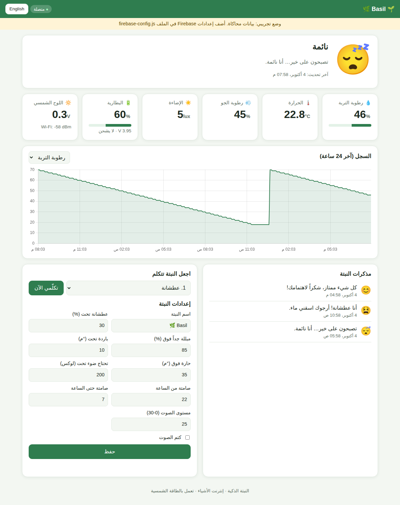

# 06 · Web Application (Dashboard)

Code: [`web/`](../web): `index.html`, `style.css`, `app.js`, `firebase-config.js`. No build step is needed: it is plain
HTML/CSS/JavaScript.

## 6.1 Features

* **Login** with Firebase Authentication (email + password).
* **Mood card:** big animated emoji, title and message. It turns orange when the plant needs something.
* **Live cards:** soil moisture (with bar), temperature, air humidity, light (lux), battery % + volts + charging,
  solar panel volts, Wi-Fi signal.
* **Online / offline badge:** online if the plant sent data during the last 2 minutes.
* **History chart (24 h)** with a selector: moisture / temperature / humidity / light / battery (Chart.js).
* **Plant diary:** the last 30 mood changes, with time.
* **Make the plant speak:** choose a voice message → "Speak now". The plant plays it within 30 s.
* **Plant settings:** name, thresholds, quiet hours, volume, mute. They are saved in Firebase and the ESP32 applies them.
* **Arabic (RTL) / English** switch, **dark mode** automatic, **responsive** on phones.
* **Demo mode** with simulated data (no Firebase needed), useful for designing and presenting.



## 6.2 Run it on your computer

The page uses JavaScript modules, so open it through a small local web server, not by double-clicking it:

```bash
cd smart-plant-iot/web
python -m http.server 8000          # or: npx serve .
```
Open <http://localhost:8000/?demo=1> (demo) or <http://localhost:8000> (real data after configuring Firebase).
In VS Code, the **Live Server** extension also works.

## 6.3 Connect it to your Firebase

Edit [`web/firebase-config.js`](../web/firebase-config.js) and paste the `firebaseConfig` from Firebase
([04](04-firebase-setup.md), step 4). Keep `PLANT_ID = "plant01"`, the same as in the firmware.
While `apiKey` still starts with `YOUR_`, the page stays in demo mode.

## 6.4 Publish it online

```bash
cd smart-plant-iot
firebase deploy --only hosting
```
→ `https://<project-id>.web.app`. Users must sign in with an account created in Firebase Authentication.

## 6.5 How the code works (`app.js`)

* `firebaseSource()` loads the Firebase SDK (v10, from Google's CDN), signs in, and **subscribes** with `onValue()` to:
  `live`, `history` (last 288 points = 24 h), `events` (last 30) and `config`.
  Firebase pushes every change to the page **in real time** (WebSocket), so no refresh is needed.
* `demoSource()` makes the same calls with simulated data.
* `renderLive()`, `renderChart()`, `renderEvents()` and `fillSettings()` update the page.
* `saveConfig()` → `update(plants/plant01/config)`, `speak(n)` → `set(plants/plant01/command, {play: n})`.
* All the texts are in the `TEXT.ar` / `TEXT.en` dictionaries, so translation is easy.
