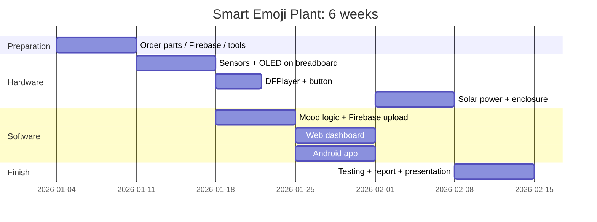

# 09 · 6-Week Project Plan and Team Roles

## 9.1 Team roles (6 members)

| Role | Main responsibility |
|---|---|
| **Team leader + integration** | Planning, meetings, purchasing, final integration, presentation |
| **Hardware & wiring** | Sensors, OLED, DFPlayer, breadboard → soldered board, enclosure |
| **Solar & power** | Solar panel, TP4056, batteries, MT3608, power measurements, safety |
| **Firmware (ESP32)** | Arduino code, calibration, mood logic, voice messages |
| **Web + Firebase** | Firebase project, rules, web dashboard, hosting |
| **Android + documentation** | Android app, screenshots, report writing, demo video |

Everyone records voices, tests the system, and writes their own part of the report.

## 9.2 Weekly plan

| Week | Goals | Deliverables |
|---|---|---|
| **1** | Approve the proposal. Study the docs. **Order the components**. Create the Firebase project and accounts. Install Arduino IDE + Android Studio. Record the voice messages | BOM bought, Firebase ready, voice MP3 files |
| **2** | Breadboard: ESP32 + OLED (faces), BH1750, DHT22, soil sensor. Calibrate the soil sensor | Faces and readings on the Serial Monitor |
| **3** | DFPlayer + speaker. Mood logic. Wi-Fi + Firebase upload. Button | Plant talks, data visible in the Firebase console |
| **4** | Web dashboard (deploy to Hosting). Android app (build APK) | Working web + Android with live data |
| **5** | Solar power chain + batteries, ECO mode. Solder onto perfboard, enclosure, mount on the pot. 24 h outdoor test | Fully solar-powered prototype |
| **6** | Run the full test plan ([08](08-testing-calibration.md)), fix bugs, write the report, slides, demo video, rehearse | Final report, presentation, demo |

(Change the dates to your semester.)

## 9.3 Risks and mitigation

| Risk | Mitigation |
|---|---|
| Components arrive late | Order in week 1 from a local shop. Buy spare sensors |
| Burned module (wrong polarity) | Check VCC/GND twice. Set the MT3608 to 5.0 V before connecting it |
| College Wi-Fi blocks devices / needs a login page | Use a **phone hotspot** (2.4 GHz) for the demo |
| Not enough sun during the demo | Fully charge the batteries the day before (TP4056 has a USB-C input) |
| Android build problems | Use the web dashboard (it works on phones too) as a backup, and build the APK early (week 4) |
| Firebase settings wrong | Test with the `curl` commands in [04](04-firebase-setup.md) and the demo mode of the web |
